# Documentação Modelo Preditivo - Inteli

## PRIZ
### Verum
#### Anna Aragão, Eduardo Ferrari, Gabrielle Mitoso, Kaylane Vasconcelos, Rafaela Rojas, Raissa de Cássia

## Sumário
[1. Introdução](#t1)

[2. Objetivos e Justificativa](#t2)
  - [2.1 Objetivos](#s1)
  - [2.2 Proposta de solução](#s2)
  - [2.3 Justificativa](#s3) 

[3. Metodologia](#t3)

[4. Desenvolvimento e Resultados](#t4)
  - [4.1 Compreensão do Problema](#s4)
    - [4.1.1 Contexto da indústria](#s5)
    - [4.1.2. Análise SWOT](#s6)
    - [4.1.3. Planejamento Geral da Solução](#s7)
    - [4.1.4. Value Proposition Canvas](#s8)
    - [4.1.5. Matriz de Riscos](#s9)
    - [4.1.6. Personas](#s10)
    - [4.1.7. Jornadas do Usuário](#s11)
    - [4.1.8 Política de Privacidade](#s12)
  - [4.2 Compreensão dos Dados](#s13)
    - [4.2.1. Exploração de dados](#s14)
    - [4.2.2. Pré-processamento dos dados](#s15)
    - [4.2.3. Hipóteses](#s16)
  - [4.3 Preparação dos Dados e Modelagem](#s17)
  - [4.4 Comparação de Modelos](#s18)
  - [4.5 Avaliação](#s19)

[5. Conclusões e Recomendações](#t5)

[6. Referências](#t6)

## 1. Introdução

&emsp;&emsp;A Comissão de Valores Mobiliários (CVM) é uma autarquia federal brasileira de grande relevância no mercado financeiro. Sua atuação como entidade reguladora e fiscalizadora do mercado de valores mobiliários abrange desde as operações das maiores empresas listadas em bolsa até os investidores individuais. Com sede no Rio de Janeiro, a CVM desempenha um papel crucial na supervisão e no desenvolvimento do mercado, com foco na proteção dos investidores e na manutenção da integridade e transparência nas operações financeiras. 

&emsp;&emsp;Além de suas funções regulatórias, também promove a educação financeira e auxilia no planejamento financeiro das pessoas. Ainda, ocupa uma posição central dentro do mercado financeiro brasileiro, agindo como guardiã da integridade e da transparência nas transações envolvendo valores mobiliários. Seu papel é crucial para garantir que as operações ocorram de maneira justa, segura e em conformidade com as regulamentações. Por fim, também desempenha um papel significativo na construção da confiança dos investidores no mercado de capitais, contribuindo para a atração de investimentos e o desenvolvimento econômico do país.

&emsp;&emsp;Visto a necessidade de transparência nas negociações para a atração de novos investidores, a CVM juntamente com o INTELI, irão criar um Modelo Preditivo para a identificação da ausência de constituição de provisão para perdas dos ativos e para a insuficiência da provisão constituída.

## 2. Objetivos e Justificativa
### 2.1 Objetivos

&emsp;&emsp;A parceria entre o Instituto de Tecnologia e Liderança e a Comissão de Valores Mobiliários tem como objetivo desenvolver um modelo preditivo que será usado como ferramenta para os administradores do FIDC para prevenir a falta de provisão para eventuais perdas decorrentes sobretudo da inadimplência dos créditos cedidos. Enquanto isso, os alunos envolvidos no projeto terão a oportunidade de aprender os conceitos necessários para desenvolver a solução, aprofundando seus conhecimentos em Python e suas bibliotecas, ciência de dados e mercado financeiro.

#### Objetivos gerais:
&emsp;&emsp;Os objetivos gerais do projeto visam fornecer uma visão ampla do que o projeto pretende alcançar. Eles devem destacar a finalidade geral do modelo preditivo para FIDS e o impacto que ele terá. Os objetivos gerais podem incluir:

* Tomada de decisão informada: Os administradores receberão insights que servirão de apoio para a tomada de decisão sobre o FIDC e a provisão necessária;
* Otimização de recursos: Ao prever uma necessidade de previsão o FIDC otimiza o uso de recursos tecnológicos, financeiros e de mão de obra;
* Gerenciamento de riscos: O modelo poderá ser usado para avaliar riscos e incertezas permitindo que o FIDC tome medidas para mitigar esses riscos com antecedência.

#### Objetivos específicos:
&emsp;&emsp;Os objetivos específicos são metas mais detalhadas e concretas que contribuirão para a realização dos objetivos gerais. Eles devem ser mensuráveis e orientados para a ação. Alguns exemplos de objetivos específicos podem ser:

* Conformidade regulatória: Ter um modelo preditivo pode ajudar o fundo a cumprir requisitos regulatórios e a demonstrar às autoridades reguladoras que estão tomando medidas adequadas para gerenciar riscos;
* Aumento da transparência: Usar um modelo preditivo transparente e bem documentado para gerenciar riscos financeiros pode aumentar a confiança dos investidores e reguladores no fundo, pois mostra um compromisso com a gestão prudente e baseada em dados.
* Redução de Perdas Financeiras: Ao identificar e agir sobre os créditos problemáticos com antecedência, o fundo pode minimizar as perdas decorrentes da inadimplência, ajudando a proteger o valor dos ativos e os retornos dos investidores.

### 2.2 Proposta de solução
&emsp;&emsp;A CVM (Comissão de Valores Mobiliários), como controladora dos dados que serão tratados no desenvolvimento do modelo preditivo, disponibilizou os Informes Gerais do FIDC, que oferecem diversos dados que serão usados para analisar a probabilidade de inadimplência dos créditos cedidos para que os analistas possam planejar as provisões necessárias.

&emsp;&emsp;Nesse projeto a Verum usará uma metodologia ágil chamada CRISP-DM que significa Cross Industry Standard Process for Data Mining, traduzindo Processo Padrão Inter-Indústrias para Mineração de Dados, que possui um processo cíclico com seis passos interligados, esse modelo será usado para que possamos realizar um processo que realize explorações a cada etapa e permita retornar a estágios anteriores quando houver necessidade.

&emsp;&emsp;Na primeira fase, desenvolveremos o entendimento do negócio, onde o projeto e o mercado onde ele está inserido serão analisados e focaremos no objetivo do projeto seguindo os interesses do parceiro, analisando riscos e delimitando aplicação de acordo com tempo, custo, mão de obra e outros aspectos.

&emsp;&emsp;Na segunda fase, entenderemos os dados oferecidos pela CVM, realizando uma análise exploratória para entender melhor as características dos dados, identificar padrões, tendências, anomalias e insights preliminares que possam guiar análises mais aprofundadas e tomadas de decisão informadas.

&emsp;&emsp;Na terceira fase, os dados serão preparados para a modelagem, assim, será realizada uma seleção dos dados mais relevantes, limpeza de dados corrompidos, construção de novos conjuntos de dados e integração de dados que possam agregar à análise, como dados sobre desemprego, pandemia e outras crises.

&emsp;&emsp;Na quarta fase realizaremos a modelagem dos dados, aqui o algoritmo de aprendizado de máquina será desenvolvido usando o TARGET indicado pelo parceiro, onde o valor em risco dos Direitos Creditórios com riscos e benefícios são somados com valor em risco dos Direitos Creditórios sem riscos e benefícios e depois dividido pelo patrimônio líquido.

&emsp;&emsp;Na quinta fase a qualidade, fidedignidade e segurança dos resultados obtidos da etapa de modelagem serão avaliadas, assim todo o processo será revisado para alinhar o modelo aos objetivos estipulados no início do projeto, definindo através de feedbacks e análises quais serão os próximos passos do processo.

&emsp;&emsp;E por fim, na última fase o projeto será implementado colocando o modelo em produção e estipulando roadmaps.

### 2.3 Justificativa
&emsp;&emsp; O modelo preditivo da Verum se destaca principalmente pela sua metodologia sólida e aprofundada baseada na CRISP-DM, pela exploração profunda dos dados fornecidos pela CVM e pela precisão na avaliação de riscos ao modelar um algoritmo de machine learning altamente adaptado ao projeto com o parceiro. Com esses três fatores combinados, o projeto apresenta um potencial de se tornar altamente valioso para o mercado financeiro, auxiliando no planejamento estratégico da CVM e mantendo a saúde do mercado estável.

## 3. Metodologia
&emsp;&emsp;O CRISP-DM, que representa o Cross-Industry Standard Process for Data Mining, é um modelo de processo que desfruta de ampla aceitação e uso na área de mineração de dados. Esta estrutura oferece uma orientação abrangente que abarca todas as fases de projetos de mineração de dados, desde a fase inicial de concepção até a etapa final de implementação. O diferencial do CRISP-DM é a ênfase que coloca na compreensão profunda do contexto de negócios que envolve o projeto, bem como na adoção de um ciclo de vida iterativo.

&emsp;&emsp;O cerne da filosofia do CRISP-DM reside na garantia de que os resultados derivados da mineração de dados sejam não apenas precisos, mas também relevantes e altamente úteis para a organização em questão. Essa abordagem estruturada visa não apenas extrair conhecimento valioso dos dados, mas também assegurar que esse conhecimento seja aplicável aos objetivos e desafios específicos que a empresa enfrenta. Ao fazer isso, o CRISP-DM capacita as equipes de projeto a tomar decisões mais informadas e embasadas em dados, o que pode levar a melhorias significativas nos processos, na eficiência e, em última análise, no desempenho organizacional como um todo. Portanto, esse modelo representa uma ferramenta vital para qualquer organização que busque alavancar o poder dos dados para impulsionar o sucesso e a competitividade.
Essa metodologia é formada por um ciclo de vida de 6 etapas:

- Compreensão do Negócio (Business Understanding): Nesta etapa, os profissionais de mineração de dados trabalham em estreita colaboração com os stakeholders do negócio para definir os objetivos e requisitos do projeto. Isso envolve a compreensão dos desafios do negócio que a mineração de dados pode resolver e a definição das metas que a equipe deseja alcançar.
- Compreensão dos Dados (Data Understanding): Aqui, a equipe coleta e explora os dados relevantes disponíveis. Isso inclui a identificação de fontes de dados, a coleta de dados brutos, a avaliação da qualidade dos dados e a análise inicial para identificar tendências ou padrões preliminares.
Preparação dos Dados (Data Preparation): Nesta fase, os dados são preparados para análise. Isso envolve a limpeza dos dados, tratamento de valores ausentes, transformações, seleção de características relevantes e formatação adequada. O objetivo é criar um conjunto de dados pronto para alimentar os algoritmos de mineração de dados.
- Modelagem (Modeling): Aqui, são selecionados e aplicados algoritmos de mineração de dados aos dados preparados. Várias técnicas de modelagem são usadas para criar modelos que podem ajudar a alcançar os objetivos do projeto. Essa etapa também envolve a avaliação e a validação dos modelos para garantir sua eficácia.
- Avaliação (Evaluation): Após a criação dos modelos, eles são avaliados quanto à sua qualidade e adequação aos objetivos do projeto. Isso inclui a medição do desempenho dos modelos, a comparação com critérios de sucesso definidos na primeira etapa e a identificação de eventuais melhorias necessárias.
- Implantação (Deployment): Na última etapa, os resultados da mineração de dados são colocados em prática no ambiente de negócios. Isso pode envolver a implementação de soluções, relatórios ou sistemas baseados nos modelos criados. É importante monitorar continuamente a implementação para garantir que os resultados sejam úteis e estejam alinhados com os objetivos de negócios.

Figura 1: CRISP-DM

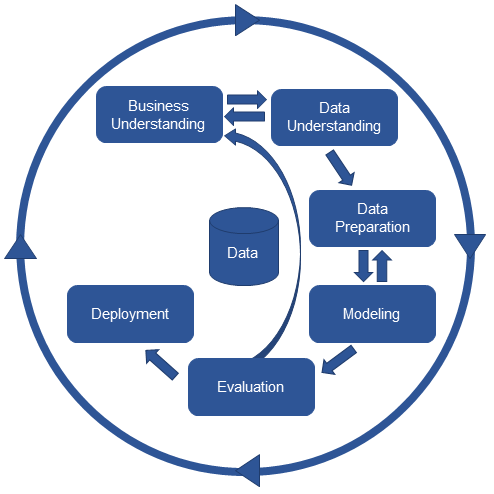

Fonte: Medium (2019)

&emsp;&emsp;Cada uma dessas etapas foi adaptada e aplicada de acordo com as necessidades específicas do projeto, como detalhado na seção 2.2 do documento. Essa abordagem baseada na metodologia CRISP-DM permitiu uma estrutura organizada e eficaz para a condução do projeto, garantindo que os resultados fossem relevantes.

## 4. Desenvolvimento e Resultados
### 4.1. Compreensão do Problema
#### 4.1.1. Contexto da indústria 
&emsp;&emsp;A análise das Cinco Forças de Porter proporciona a capacidade de cartografar o cenário mercadológico visando o fortalecimento do planejamento estratégico e aprimoramento da tomada de decisões empresariais. Seja para a incursão em um novo mercado, a execução de um projeto de cunho estratégico ou a avaliação das condições correntes em relação ao setor em sua totalidade, essa abordagem assenta-se sobre alicerces de fatos e análises metodicamente conduzidas. Sua ênfase repousa nos elementos que tangenciam a esfera competitiva. Cada uma das Cinco Forças de Porter exerce a capacidade de impactar a rentabilidade de um empreendimento, consoante ao grau de influência que ostentam no segmento em questão. Estas são: Concorrentes, Fornecedores, Clientes, Novos Entrantes e Substitutos. A seguir, encontram-se minuciosamente delineados sob a perspectiva da Comissão de Valores Mobiliários.

- **Rivalidade entre os concorrentes existentes:**
&emsp;&emsp;A Comissão de Valores Mobiliários (CVM), enquanto uma eminente autarquia dotada de responsabilidades regulatórias no âmbito dos mercados financeiros, encontra-se invariavelmente inserida em um contexto onde a rivalidade intrínseca entre atores concorrentes delineia uma dinâmica complexa. Tal rivalidade, qual se manifesta de maneira multifacetada, transcende as fronteiras da mera competição comercial e se estende na esfera da busca por recursos escassos, alocativos orçamentários e, não menos importante, a veneração da atenção governamental.

&emsp;&emsp;Em um cenário de regulação financeira, a CVM se vê imersa em um intricado xadrez estratégico, onde a miríade de participantes do mercado exerce pressões sutis e não tão sutis, no intuito de moldar as políticas regulatórias em prol de suas vantagens competitivas. Nesse tabuleiro de interesses confluentes e divergentes, a batalha pela alocação de recursos assume um papel de destaque, representando uma espécie de campo de combate intangível, onde os agentes buscam garantir sua parcela dos recursos disponíveis para sustentar suas atividades e agendas.

&emsp;&emsp;Ademais, é imperioso reconhecer que a CVM se encontra em um estado de constante vigilância, à medida que o cenário dos mercados financeiros evolui em um compasso ininterrupto. O cenário de evolução disruptiva, precipitado por avanços tecnológicos, mudanças regulatórias e complexificação financeiras, impõe à CVM a inelutável tarefa de manter-se vigilante e adaptativo. A pressão por manter a eficiência e a eficácia de suas regulamentações assume contornos cada vez mais desafiantes, uma vez que a capacidade de permanecer à altura dos rápidos e frequentes rearranjos do panorama financeiro se torna uma imperativa constante.

- **Ameaça de novos entrantes:**
&emsp;&emsp;Dentro do abrangente cenário da regulação do mercado de valores mobiliários, a perspectiva de novos órgãos reguladores ingressarem nesse domínio não se configura como uma ameaça de relevância incontestável. No contexto específico do Brasil, é notório que a Comissão de Valores Mobiliários (CVM) ocupa a posição preeminente de autoridade designada pelo governo para exercer essa função fundamental. Ao longo dos anos, a CVM solidificou sua autoridade e credibilidade por meio de sua atuação constante e regulamentações eficazes.

&emsp;&emsp;A unicidade regulatória é um fator notável no cenário brasileiro, no qual a CVM detém a responsabilidade singular pela supervisão, fiscalização e regulamentação do mercado de valores mobiliários. Essa concentração de atribuições em um único órgão demonstra a confiança depositada na CVM para preservar a integridade, transparência e equidade do mercado, além de assegurar que os investidores estejam protegidos e informados adequadamente.

&emsp;&emsp;No entanto, vale ressaltar que a possibilidade de novos órgãos reguladores entrarem em cena não pode ser descartada por completo. O cenário financeiro global está em constante evolução, e a interconexão dos mercados pode motivar discussões sobre a criação de novas autoridades reguladoras especializadas em certos aspectos ou instrumentos financeiros. Nesse sentido, a complexidade dos investimentos offshore, que muitas vezes transcendem fronteiras geográficas e jurisdicionais, poderia impulsionar a busca por abordagens regulatórias mais focalizadas.

&emsp;&emsp;No que tange aos investimentos offshore, nos quais os investidores alocam recursos em ativos financeiros fora do país de origem, é pertinente considerar a crescente popularidade dessas estratégias. O potencial aumento dos investimentos offshore pode desencadear discussões sobre a necessidade de uma supervisão mais abrangente e especializada, possivelmente levando a debates sobre a viabilidade de criar entidades reguladoras específicas para esse domínio.

- **Poder de barganha dos fornecedores:**

&emsp;&emsp;A Comissão de Valores Mobiliários (CVM), enquanto uma entidade reguladora de natureza governamental, apresenta uma dinâmica peculiar em relação à sua relação com fornecedores, que difere do conceito tradicional de fornecedores. Devido à sua função primordial de supervisionar e regular o mercado de valores mobiliários, a CVM não se envolve em arranjos convencionais de fornecimento, no entanto, é crucial salientar que a CVM opera em um ecossistema interdependente onde a obtenção de informações onde a obtenção de informações precisas e abrangentes é essencial para o cumprimento eficaz de sua missão regulatória.

&emsp;&emsp;A CVM depende, de maneira substancial, das informações que são submetidas pelas empresas que se encontram registradas no mercado de valores mobiliários. Essas informações constituem a base sobre a qual a CVM conduz suas avaliações, decisões e diretrizes regulatórias. Além disso, é através da análise desses dados que a CVM pode identificar tendências, riscos sistemáticos e irregularidades que possam requerer ação regulatória. A colaboração entre a CVM e as empresas registradas, portanto, assume um papel crucial na garantia da integridade e eficiência do mercado.

&emsp;&emsp;A complexidade do mercado financeiro também exige que a CVM estabeleça relações colaborativas com diversas outras instituições financeiras e entidades reguladoras. Essas colaborações envolvem trocas de informações, discussões de melhores práticas e ações coordenadas para preservar a estabilidade do mercado e proteger os investidores. Nesse sentido, a CVM busca constantemente promover um ambiente de cooperação mútua, a fim de enfrentar os desafios dinâmicos e multifacetados apresentados pelo cenário financeiro.

&emsp;&emsp;É relevante considerar que, embora a CVM não possua fornecedores no sentido convencional, a obtenção e o compartilhamento de informações precisas, oportunas e abrangentes são elementos fundamentais para a eficácia da supervisão regulatória. A interdependência entre a CVM, e as empresas registradas e as instituições colaborativas constrói um ecossistema no qual o poder de barganha dos fornecedores de informações pode, de fato, exercer influência sobre a qualidade e efetividade das atividades de supervisão realizadas pela CVM. Nesse contexto, a busca por um equilíbrio saudável entre a necessidade de informações e a garantia de imparcialidade regulatória permanece como um desafio constante a ser enfrentado pela CVM.

- **Poder de barganha dos compradores:**
&emsp;&emsp;As principais entidades atendidas pela Comissão de Valores Mobiliários (CVM) compreendem predominantemente as organizações que participam das operações no mercado de valores mobiliários, assim como os próprios indivíduos que alocam recursos financeiros. As corporações que efetuaram seus devidos registros na CVM estão sujeitas à estrita observância das normativas por ela estabelecidas, enquanto os investidores depositam sua confiança na CVM com o intuito de salvaguardar seus interesses. Logo, é pertinente reconhecer que o poder de negociação detido pelos clientes, tanto as corporações quanto os investidores, pode se encontrar sujeito a certas limitações em virtude da natureza compulsória inerente ao cumprimento das regulamentações.

- **Ameaça de produtos ou serviços substitutos:**
&emsp;&emsp;A perspectiva de produtos ou serviços substitutos representa uma preocupação latente para o mercado em questão. Em particular, o cenário contempla a viabilidade iminente da incursão de mercados financeiros estrangeiros, caracterizados não apenas por diferentes jurisdições regulatórias, mas também por formas de investimento alternativas que operam fora da esfera de supervisão direta da Comissão de Valores Mobiliários (CVM).

&emsp;&emsp;A complexidade do panorama é tal que as regulamentações estabelecidas pela CVM, apesar de suas intenções benéficas e orientadas para a proteção do investidor, podem se revelar insuficientes para conter os influxos de tais alternativas de investimento. Essa possibilidade acarreta, por sua vez, um potencial impacto sobre a atratividade intrínseca e a competitividade subjacente do mercado de valores mobiliários brasileiro.

&emsp;&emsp;Nesse contexto, a eficácia das regulamentações da CVM emerge como um fator crítico que não apenas influencia, mas também dita os contornos das escolhas dos investidores. A capacidade do mercado de valores mobiliários brasileiro de manter sua posição de destaque enfrenta, portanto, um teste substancial diante da emergência dessas alternativas. A relativa facilidade de acesso, a flexibilidade de mecanismos e a possibilidade de operação em um ambiente menos onerado por regulamentações rígidas são aspectos que podem conferir a essas alternativas um poder de atração significativo.

&emsp;&emsp;Nesse sentido, a ameaça representada por produtos ou serviços substitutos reveste-se de uma relevância estratégica que não pode ser subestimada. O mercado financeiro nacional encontra-se à beira de uma bifurcação, onde a adoção de abordagens inovadoras, a modernização das regulamentações e a ênfase na transparência e confiança assumem uma importância exacerbada. Somente através de tais medidas, aliadas a um compromisso renovado com a eficiência e a proteção dos investidores, será possível mitigar os riscos inerentes à mencionada ameaça e reafirmar a posição do mercado de valores mobiliários brasileiro como um ícone de solidez e oportunidade.

Figura 2: 5 forças de porter
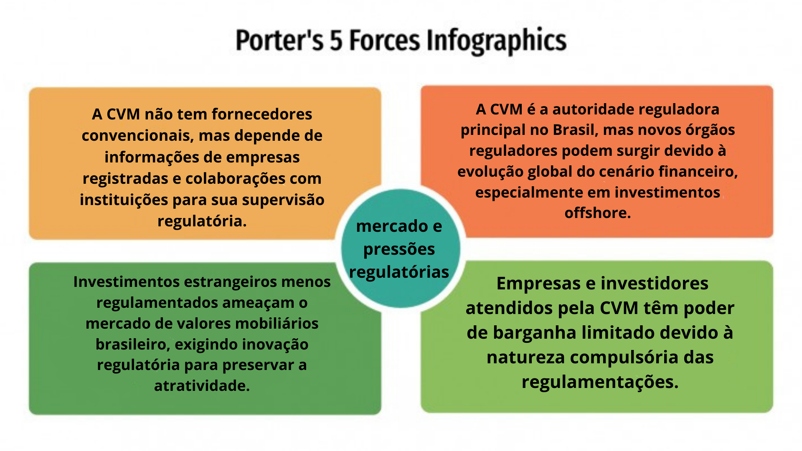
Fonte: Material produzido pelos autores(2023)

### 4.1.2. Análise SWOT

&emsp;&emsp;A matriz SWOT é uma ferramenta utilizada para melhorar o entendimento acerca das forças, fraquezas, ameaças e oportunidades (Strenghts, Weaknesses, Opportunities, Threats) de uma empresa. Dentro dessa análise, existe a separação dos fatores internos (forças e fraquezas), os quais estão dentro do controle da empresa e representam falhas ou forças operacionais, e os fatores externos (oportunidades e ameaças), os quais estão fora do controle da empresa, porém, em alguns casos, podem ser evitados ou aproveitados de acordo com as informações disponíveis e com planejamento prévio. Na imagem 3 abaixo, encontra-se o diagrama da matriz SWOT da CVM, parceiro atual do módulo.

Figura 3: análise swot
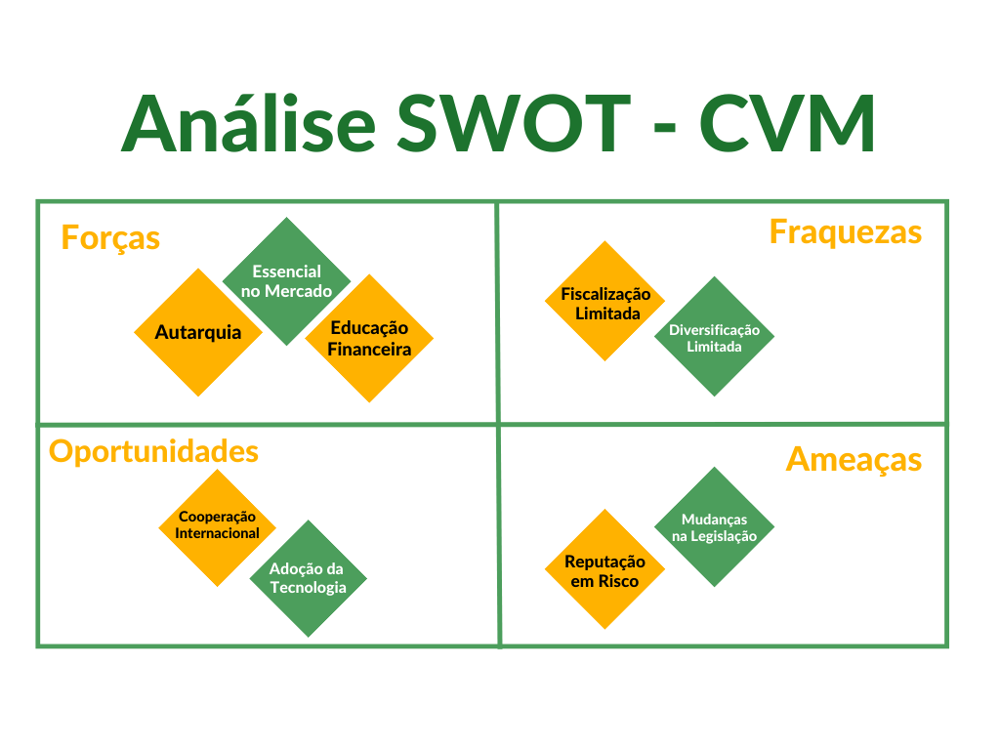
Fonte: Material produzido pelos autores(2023)

#### Forças:
- **Órgão Público Autárquico**:
&emsp;&emsp;A CVM não só é um órgão público, o que ajuda na credibilidade da empresa em sua fiscalização e regulamentação, como também é uma autarquia federativa, o que significa que ela possui autonomia administrativa e financeira, além de patrimônio próprio.
- **Essencial no Mercado**:
&emsp;&emsp;Sem a ação reguladora da CVM no mercado de valores mobiliários, a segurança dos investidores estaria completamente comprometida e a transparência no mercado seria inexistente. Assim, a CVM possui uma função tão fundamental no mercado que sua importância e relevância sempre serão reconhecidas nacionalmente, sendo insubstituível.
- **Programas de Educação Financeira para Pequenos Investidores**:
&emsp;&emsp;Além de lidar com fiscalização, disciplina e desenvolvimento do mercado, a CVM também colabora com o desenvolvimento da cultura dos, disponibilizando cursos de educação financeira nas escolas e promovendo o aprendizado, o que gera investidores mais conscientes e bem informados, evitando o número de golpes e melhorando a saúde do mercado financeiro.
#### Fraquezas:
- **Fiscalização Limitada**:
&emsp;&emsp;Por conta da legislação brasileira, existem limites na fiscalização da CVM, em prol da proteção da privacidade. Assim, não é possível fiscalizar as empresas o tempo todo, o que dificulta na busca da transparência do mercado.
- **Diversificação no Mercado Limitada**:
&emsp;&emsp;Mesmo sendo uma autarquia, a CVM continua sendo um órgão federal com uma função pré estabelecida, o que pode impedir a expansão da empresa para diferentes negócios caso seja muito diferente da sua função atual.
#### Oportunidades:
- **Cooperação Internacional com outros Órgão Reguladores**:
&emsp;&emsp;Em possíveis casos de grandes esquemas de corrupção, uma forma com que a CVM pode lidar com o problema de forma mais efetiva é contatando órgãos reguladores de mercado de outros países, como a SEC dos Estados Unidos (U.S. Securities and Exchange Commission), com o objetivo de trocar informações que podem ser úteis para uma investigação.
- **Adoção da Tecnologia**:
&emsp;&emsp;A tecnologia é uma ferramenta que deve ser aproveitada em todas as empresas, inclusive na CVM. Um possível uso da tecnologia seria a automação na fiscalização e supervisão do mercado, além da implementação da inteligência artificial e de machine learning para detectar possíveis anomalias no mercado.
#### Ameaças:
- **Reputação em Risco**:
&emsp;&emsp;Por ser um órgão fiscalizador, a CVM possui um papel essencial no mercado. Logo, qualquer falha na sua fiscalização gera consequências econômicas graves para o país. Dessa forma, com qualquer crise econômica gerada no mercado financeiro, grande parte da responsabilidade será atribuída à CVM, denegrindo sua reputação.
- **Mudanças na Legislação**:
&emsp;&emsp;Caso ocorra alguma mudança na legislação nacional que contribua para maior liberdade e menor fiscalização nas empresas do mercado, os poderes da CVM seriam limitados, diminuindo sua capacidade de regulamentação no mercado e tornando-o um ambiente mais propício para corrupção.

### 4.1.3. Planejamento Geral da Solução
&emsp;&emsp;Os dados disponíveis para o projeto foram fornecidos pela Comissão de Valores Mobiliários (CVM) e consistem principalmente no Informe Mensal dos Fundos de Investimento em Direitos Creditórios (FIDC). Estes dados incluem informações detalhadas sobre os créditos cedidos nos FIDCs, como valores numéricos, datas de vencimento, taxas de juros, entre outros dados relevantes. Além disso, na solução, podem estar disponíveis dados secundários que possam ser relevantes para a análise, como informações macroeconômicas ou setoriais.

&emsp;&emsp;O grupo Verum prepõe o desenvolvimento de um modelo preditivo usando a metodologia ágil CRISP-DM. Esse modelo será capaz de prever a probabilidade de inadimplência de créditos cedidos em Fundos de Investimento em Direitos Creditórios (FIDC) através da aplicação da tarefa de regressão. O processo envolve a compreensão do negócio e dos dados, preparação dos dados, modelagem, avaliação dos resultados e implementação do modelo. A solução visa criar um algoritmo de aprendizado de máquina que calcule o risco dos direitos creditórios, assegurando a qualidade e segurança dos resultados em todas as fases.

&emsp;&emsp;O tipo de tarefa adotado para essa solução é a regressão. A tarefa de regressão é utilizada para prever valores numéricos contínuos, neste caso, a probabilidade de inadimplência dos créditos cedidos nos FIDCs. O modelo desenvolvido buscará estimar essa probabilidade com base nos dados históricos disponíveis.

&emsp;&emsp;A solução proposta será utilizada para calcular o risco dos direitos creditórios nos Fundos de Investimento em Direitos Creditórios (FIDCs). Após o desenvolvimento do modelo preditivo, ele será integrado ao processo de análise de crédito desses fundos. Isso permitirá aos gestores de investimento terem uma avaliação mais precisa da probabilidade de inadimplência dos créditos, auxiliando nas decisões de investimento e gerenciamento de risco.

&emsp;&emsp;A solução proposta traz diversos benefícios. Primeiramente, oferece uma abordagem mais precisa na avaliação do risco de inadimplência, permitindo aos gestores tomarem decisões informadas e estratégicas. Além disso, a automatização desse processo por meio do modelo de aprendizado de máquina reduzirá a dependência de avaliações manuais, aumentando a eficiência operacional. A implementação do modelo também pode resultar em uma alocação mais eficiente de recursos financeiros, minimizando perdas decorrentes de inadimplências não previstas.

&emsp;&emsp;O critério de sucesso para o projeto é alcançar uma acurácia de no mínimo 90% nas previsões do modelo. A acurácia mede a proporção de previsões corretas em relação ao total de previsões feitas. No contexto de avaliação de risco de inadimplência, uma alta acurácia indicaria que o modelo é capaz de identificar corretamente a maioria dos casos de inadimplência. Além disso, a equipe poderia considerar a utilização de métricas adicionais, como a área sob a curva ROC (AUC-ROC), que fornece uma medida da capacidade do modelo de distinguir entre classes positivas e negativas.

### 4.1.4. Value Proposition Canvas
&emsp;&emsp;O Canvas de Proposta de Valor (Value Proposition Canvas) é uma ferramenta visual que auxilia na criação de uma proposta de valor mais estruturada para produtos ou serviços baseados nas necessidades do cliente. Sendo assim, ela apresenta duas partes: perfil do cliente, o qual possui suas tarefas, dores e ganhos e proposta de valor, o qual evidenciam os produtos e serviços, os aliviadores das dores e os criadores de ganhos.

&emsp;&emsp;Portanto, para melhor apresentar a proposta de valor do projeto, foi realizada uma análise e o desenvolvimento do canvas de proposta de valor demonstrado na imagem 4 a seguir. 

Figura 4: Value Proposition Canvas
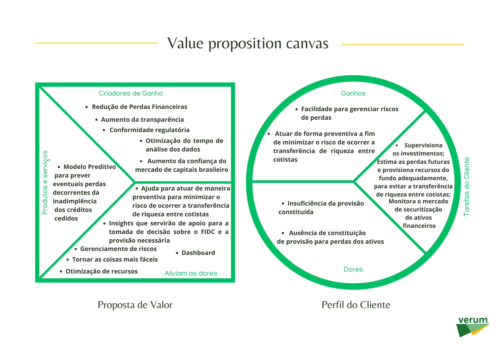
Fonte: Material produzido pelos autores(2023)

&emsp;&emsp;Sendo assim, é válido ressaltar e explicar que os principais ganhos que o usuário terá ao utilizar o modelo preditivo do grupo Verum são: redução de perdas financeiras, pois ao identificar os créditos problemáticos brevemente, o fundo poderá minimizar as perdas; aumento da transparência e confiança do mercado de capitais brasileiros, visto que ao utilizar um modelo preditivo bem documentado e seguro, aumentará a confiança dos investidores e reguladores do mercado financeiro; conformidade regulatória, dado que estará demonstrando as autoridades reguladoras que estão tomando as devidas precauções para gerenciar riscos; e otimização do tempo para análise dos dados, visto que ao ter um modelo preditivo que mostre essa análise de maneira visual por meio de um dashboard, será muito mais fácil e rápido para os analistas chegarem às devidas conclusões sobre algum fator.  

&emsp;&emsp;Dessa forma, ao usar o modelo preditivo criado pelo grupo, o usuário terá suas dores resolvidas por meio de vários fatores que foram apresentados no campo “Aliviam as dores” e através dos ganhos citados anteriormente.

### 4.1.5. Matriz de Riscos
&emsp;&emsp;A matriz de risco tem como principal objetivo indicar quais são os riscos que podem ser gerados durante o desenvolvimento do projeto, como também,  o nível de impacto de cada um, para que seja possível verificar quais precisam de maior atenção a fim de amenizá-los ou evitá-los. Entretanto, caso eles venham a acontecer, será possível reverter devido ao plano de ação criado sobre cada tópico da matriz. 

Figura 5: Matriz de risco
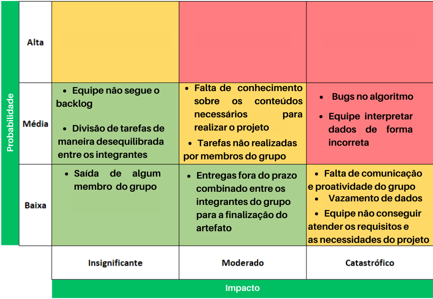
Fonte: Material produzido pelos autores(2023)

**Plano de Ação**

**Equipe não segue o backlog** - Uma possível solução é o grupo se reunir e conversar para deixar todos sabendo sobre o andamento do projeto, como também o Scrum Master ajudar na organização e incentivar a equipe a seguir o backlog.

**Divisão de tarefas de maneira desequilibrada entre os integrantes** - É possível que a equipe se reúna e faça uma nova divisão de tarefas que seja justa e não sobrecarregue ninguém. Como também, o integrante que ficar com a tarefa mais simples e rápida de se fazer, poderá ajudar quem estiver com a atividade mais complexa.

**Saída de algum membro do grupo** - A equipe deverá se organizar para refazer a divisão de tarefas e não sobrecarregar ninguém.

**Falta de conhecimento sobre os conteúdos necessários para realizar o projeto** - A equipe deverá buscar por novos aprendizados, sendo por meio da solicitação de ajuda aos professores, com videoaulas, artigos, livros, entre outros, a fim de continuar o desenvolvimento do projeto. 

**Tarefas não realizadas por membros do grupo** - A equipe deverá conversar com o membro do grupo para entender o motivo disso ter acontecido, pedir para que não se repita e dividir a tarefa entre os integrantes.

**Entregas fora do prazo combinado entre os integrantes do grupo para a finalização do artefato** - Nesse caso, a equipe deverá se reunir para entender o que está acontecendo e assim se organizar melhor para colocar as entregas em dia.

**Bugs no algoritmo** - Uma possível solução é sempre ir monitorando e fazendo testes para que isso não aconteça.

**Equipe interpretar dados de forma incorreta** -  Uma opção é se unir para revisar e analisar os dados juntos a fim de que os erros de interpretação sejam evitados.

**Falta de comunicação e proatividade do grupo** - Uma solução possível é o Scrum Master reunir o grupo para que os integrantes possam entender melhor o motivo da comunicação ser falha e incentivá-los a serem proativos.

**Vazamento de dados** - Nesse caso, a equipe deverá tomar o máximo de cuidado possível, deixando os repositórios privados e dificultando o acesso de outras pessoas aos dados. Caso venha acontecer, o grupo deverá informar ao Inteli e a CVM o mais breve possível.

**Equipe não conseguir atender os requisitos e as necessidades do projeto** - Se reunirem para mudar o mais rápido possível os desvios de ideias que não satisfazem os requisitos e as necessidades do projeto e continuarem a desenvolver a partir das novas alterações.

&emsp;&emsp;Além disso, há também a matriz de oportunidades, a qual mostra as boas hipóteses que podem surgir com o projeto e quais são os seus impactos.

Figura 6: Matriz de oportunidades
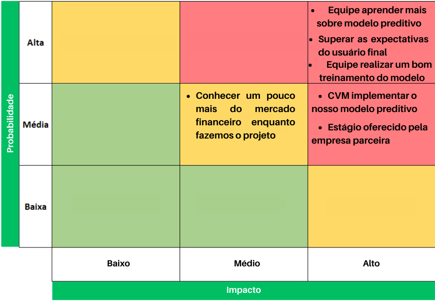
Fonte: Material produzido pelos autores(2023)

&emsp;&emsp;Portanto, as oportunidades que o grupo definiu são: 

**Conhecer um pouco mais do mercado financeiro enquanto fazemos o projeto**: Para criarmos o modelo preditivo precisaremos saber de alguns conceitos de finanças, tal como o que é FIDC. Sendo assim aprenderemos mais sobre o mercado financeiro durante o desenvolvimento do projeto.

**Equipe aprender mais sobre modelo preditivo**: Precisaremos estudar diversas coisas de UX, negócios, programação e matemática que possuem relação com modelo preditivo para conseguirmos desenvolver o projeto.

**Superar as expectativas do usuário final**: Com uma excelente entrega, poderemos superar as expectativas da CVM, fazendo com que eles queiram trazer mais projetos e oportunidades para os alunos do Inteli. 

**Equipe realizar um bom treinamento do modelo**: O grupo treinar muito bem o modelo e ele apresentar resultados bastante eficientes para a CVM. 

**CVM implementar nosso modelo preditivo**: Parceiro adorar o projeto e implementá-lo para ajudá-los a gerenciar os riscos de perda decorrentes da inadimplência dos créditos cedidos

**Estágio oferecido pela empresa parceira**: CVM gostar bastante do trabalho dos alunos e querer oferecer programas de estágio de férias para o Inteli.

### 4.1.6. Personas

&emsp;&emsp;A criação de uma persona é um dos passos mais importantes para as empresas em um âmbito geral. É através da persona que temos uma maior compreensão e clareza sobre as motivações, frustrações, objetivos e a personalidade do nosso público-alvo, utilizando uma representação fictícia do cliente ideal do negócio. 

&emsp;&emsp;Para um desenvolvimento fidedigno da persona, a caracterização é baseado em dados reais sobre o comportamento e características demográficas dos clientes, identificando pontos em comum entre os possíveis usuários finais. 

&emsp;&emsp;No caso da Comissão de Valores Mobiliários, a persona é um caso muito específico, já que nosso usuário final serão os Analistas Superintendentes de Supervisão de Securitização, nichando ainda mais as necessidades do cliente. Entendendo que esse grupo é muito seleto e com menos de cinco pessoas na equipe, a persona se torna ainda mais essencial para elevar o nível de detalhamento do público-alvo e estabelecer uma comunicação com o usuário de maneira eficaz e assertiva.

Figura 7: Persona
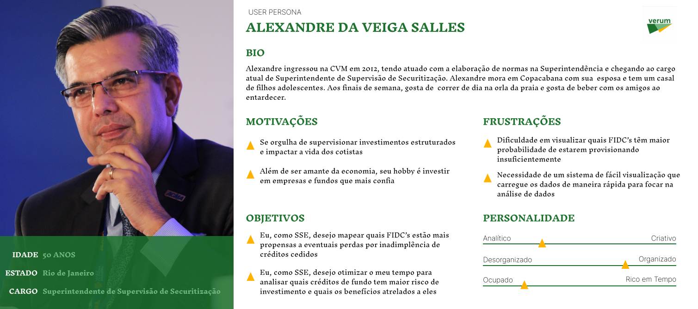
Fonte: Material produzido pelos autores(2023)

&emsp;&emsp;A persona desenvolvida para o projeto é o Alexandre, que começou a sua carreira na CVM em 2012 e alcançando o cargo de Superintendente de Supervisão de Securitização (SSE). Aos 50 anos, Alexandre mora em Copacabana com a sua esposa e um casal de filhos adolescentes e também dedica tempo ao esporte e amigos no final da tarde. Possuindo uma grande paixão pela economia, Alexandre gosta de fazer investimentos por hobby. 

&emsp;&emsp;Focado em ter uma melhor visualização de quais FIDC’s têm maior probabilidade de estarem provisionando insuficientemente, Alexandre deseja mapear essas FIDC’s que estão mais propensas a eventuais perdas por inadimplência de
créditos cedidos por meio de um dashboard, otimizando assim o tempo para analisar quais créditos de fundo tem maior risco de investimento e quais os benefícios atrelados a eles. 

### 4.1.7. Jornadas do Usuário

&emsp;&emsp;A jornada do usuário é um mapa visual que define as fases pelas quais o cliente passa até a etapa de conclusão, seja ela uma compra, tomada de decisão ou aderência de um serviço.

&emsp;&emsp;Ela descreve um passo a passo percorrido e detalhado de todos os pontos de contato e interações a partir da perspectiva do usuário e suas emoções em cada etapa do processo. 

&emsp;&emsp;Como os responsáveis pela regulamentação e segurança dos FIDCs são os usuários finais, se faz necessário entender o ponto de vista deles sobre a aplicação da solução que queremos viabilizar e como eles se sentem ao utilizar a proposta fornecida pelo grupo. Por esse motivo, entrevistas e conversas com o parceiro entram no escopo de investigação para traçar a jornada de maneira apropriada. 

Figura 8: Jornada do Usuário
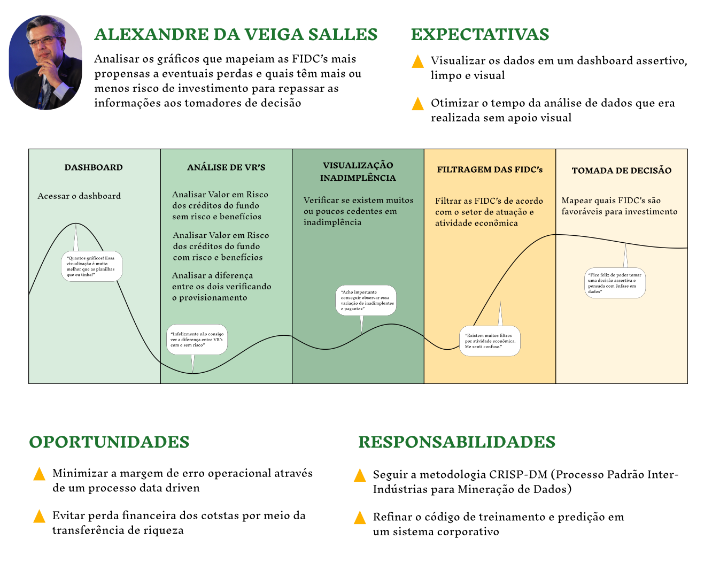
Fonte: Material produzido pelos autores(2023)

&emsp;&emsp;Tendo essa visão, o objetivo do usuário é analisar os gráficos que mapeiam as FIDC’s mais propensas a eventuais perdas e quais têm mais ou menos risco de investimento para repassar as informações aos tomadores de decisão. A expectativa desse usuário é que ele possa visualizar os dados em um dashboard e otimizar o tempo para realizar a análise desses dados. 

&emsp;&emsp;Ele passará por cinco etapas: 

  1. Dashboard: Acesso ao dashboard

  2. Análise de VR’s: Analisar Valor em Risco dos créditos do fundo com e sem risco e benefício, além de verificar a diferença entre os dois

  3. Visualização da Inadimplência: Verificar se existem muitos ou poucos cedentes em inadimplência

  4. Filtragem das FIDC’s: Filtrar as FIDC’s de acordo com o setor de atuação e atividade econômica

  5. Tomada de Decisão: Mapear quais FIDC’s são favoráveis para investimento

&emsp;&emsp;O processo desenhado acima na figura 8 tem alguns pontos de atenção, como conseguir implementar a diferença dos fundos com e sem risco e a complexidade da quantidade de filtros necessários para a etapa de filtragem dos FIDC’s. Mesmo assim, o grupo pode trabalhar com ótimas oportunidades de minimizar o erro operacional humano e evitar perdas financeiras, nem que seja de forma indireta.

&emsp;&emsp;Desta forma, é de responsabilidade da CVM seguir a metodologia CRISP-DM utilizada para definir um processo estruturado de análise de dados e refinar o código para ser utilizado como sistema interno da empresa. 

### 4.1.8 Política de Privacidade
&emsp;&emsp;A política de privacidade, em sua intrincada essência, materializa-se como um instrumento fulcral que manifesta o inabalável comprometimento de uma entidade organizacional em zelar pela inviolabilidade e preservação da privacidade dos sujeitos cujas informações pessoais são capturadas e processadas por suas operações. Este documento, que assume feições de relevância paradigmática na era contemporânea marcada pela fluidez digital, erige um arcabouço abrangente ao desvelar as práticas operacionais da instituição no manejo desses dados, delineando com meticulosidade os procedimentos adotados, as metas subjacentes a tal manipulação e as salvaguardas implementadas com a finalidade de garantir a confidencialidade e a integridade das informações de cunho pessoal.

#### 4.1.8 Política de Privacidade
&emsp;&emsp;A política de privacidade, em sua intrincada essência, materializa-se como um instrumento fulcral que manifesta o inabalável comprometimento de uma entidade organizacional em zelar pela inviolabilidade e preservação da privacidade dos sujeitos cujas informações pessoais são capturadas e processadas por suas operações. Este documento, que assume feições de relevância paradigmática na era contemporânea marcada pela fluidez digital, erige um arcabouço abrangente ao desvelar as práticas operacionais da instituição no manejo desses dados, delineando com meticulosidade os procedimentos adotados, as metas subjacentes a tal manipulação e as salvaguardas implementadas com a finalidade de garantir a confidencialidade e a integridade das informações de cunho pessoal.
&emsp;&emsp;A política de privacidade erige-se como um bastião de resguardos legais e éticos tanto para a organização que alberga os dados quanto para os titulares dessas informações sensíveis. Em conformidade com a exegese da Lei Geral de Proteção de Dados (LGPD) e outras codificações similares, a ausência de uma política de robustez incontestável pode acarretar sanções pecuniárias substanciais, corroendo a arquitetura financeira da entidade, ao passo que também macula a sua reputação na ágora pública.

&emsp;&emsp;A seguir, tem-se a política de privacidade referente ao projeto presente:

1. Informações Gerais sobre a Empresa/Organização
A presente Política de Privacidade descreve como Verum, doravante denominada "nós", coleta, utiliza e protege os dados, em conformidade com a Lei Geral de Proteção de Dados (LGPD). Esta Política de Privacidade fornece uma visão geral de nossas práticas de privacidade e das escolhas que você pode fazer, bem como direitos que você pode exercer em relação aos Dados tratados por nós. 
2. Informações sobre o Tratamento de Dados
Para os fins desta Política de Privacidade:
“Dados Pessoais” significa qualquer informação que, direta ou indiretamente, identifique ou possa identificar uma pessoa natural, como, por exemplo, nome, CPF, data de nascimento, endereço IP, dentre outros;
“Dados Pessoais Sensíveis” significa qualquer informação que revele, em relação a uma pessoa natural, origem racial ou étnica, convicção religiosa, opinião política, filiação a sindicato ou a organização de caráter religioso, filosófico ou político, dado referente à saúde ou à vida sexual, dado genético ou biométrico;
“Tratamento de Dados Pessoais” significa qualquer operação efetuada no âmbito dos Dados Pessoais, por meio de meios automáticos ou não, tal como a recolha, gravação, organização, estruturação, armazenamento, adaptação ou alteração, recuperação, consulta, utilização, divulgação por transmissão, disseminação ou, alternativamente, disponibilização, harmonização ou associação, restrição, eliminação ou destruição. Também é considerado Tratamento de Dados Pessoais qualquer outra operação prevista nos termos da legislação aplicável;
“Leis de Proteção de Dados” significa todas as disposições legais que regulem o Tratamento de Dados Pessoais, incluindo, porém sem se limitar, a Lei nº 13.709/18, Lei Geral de Proteção de Dados Pessoais (“LGPD”).
2.1 Dados Pessoais Coletados
Não há coleta de dados pessoais para o referente projeto.
2.2 Compartilhamento de Dados
Não há compartilhamento os dados pessoais com parceiros de serviços, fornecedores e subcontratados. 
2.3 Direitos dos Usuários
Respeitamos os direitos dos usuários, conforme estabelecido pela LGPD. Isso inclui o direito de acessar, corrigir, atualizar e solicitar a exclusão de seus dados pessoais.
Você pode, a qualquer momento, requerer: (i) confirmação de que seus Dados Pessoais estão sendo tratados; (ii) acesso aos seus Dados Pessoais; (iii) correções a dados incompletos, inexatos ou desatualizados; (iv) anonimização, bloqueio ou eliminação de dados desnecessários, excessivos ou tratados em desconformidade com o disposto em lei; (v) portabilidade de Dados Pessoais a outro prestador de serviços, contanto que isso não afete nossos segredos industriais e comerciais; (vi) eliminação de Dados Pessoais tratados com seu consentimento, na medida do permitido em lei; (vii) informações sobre as entidades às quais seus Dados Pessoais tenham sido compartilhados; (viii) informações sobre a possibilidade de não fornecer o consentimento e sobre as consequências da negativa; e (ix) revogação do consentimento. Os seus pedidos serão tratados com especial cuidado de forma a que possamos assegurar a eficácia dos seus direitos. Poderá lhe ser pedido que faça prova da sua identidade de modo a assegurar que a partilha dos Dados Pessoais é apenas feita com o seu titular.
2.4. Exercendo seus Direitos
Os usuários podem exercer seus direitos entrando em contato conosco através do e-mail [email]. Faremos o possível para responder prontamente a todas as solicitações.
3. Contato do Encarregado de Proteção de Dados (DPO)
Para questões relacionadas à privacidade e proteção de dados, entre em contato pelo e-mail [email].
Esta Política de Privacidade entra em vigor a partir de 09 de agosto de 2023 e pode ser revisada ocasionalmente. Quaisquer alterações serão publicadas em nosso site.

## 4.2. Compreensão dos Dados

#### 4.2.1. Exploração de dados
&emsp;&emsp;A exploração de dados é a primeira etapa da análise de dados, visando explorar e visualizar os dados a fim de ter uma melhor compreensão destes desde o início. Além disso, essa etapa é utilizada para identificar os padrões que podem ser encontrados na base de dados e focar em um aprofundamento posteriormente. 

&emsp;&emsp;Desta forma, a Comissão de Valores Mobiliários (CVM) disponibilizou uma base de dados contendo 3 tabelas no formato de arquivo CSV (Comma Separated Values / Valores Separados por Vírgula), formadas por meio dos relatórios mensais e auditorias referentes às prestações de contas por parte dos Fundos de Investimento em Direitos Creditórios (FIDC). 

As tabelas disponibilizadas são:

  1. IM_230626_semNP
Essa é a tabela principal do Informe Mensal de FIDC, detalhando todos os DCs constituintes do FIDC, detalha a carteira de DCs por segmento econômico, descreve os passivos, ativos e o valor total que pertence aos cotistas, detalha DCs com e sem aquisição de riscos e benefícios, detalha compras, vendas, substituições e recompras de DCs mensal e detalha as taxas de desconto das compras e vendas dos DCs e de outros ativos. 

Figura 9: Quantidade de linhas e colunas da Tabela IM_230626_sem_NP

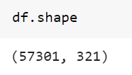

Fonte: Material produzido pelos autores(2023) 

  2. IM_Classes_230626_semNP

Essa tabela contém os dados sobre o número de cotistas, número de cotas, captações, resgates, amortizações, desempenho e garantia dos DCs do fundo, além da liquidez dos ativos. 

Figura 10: Quantidade de linhas e colunas da Tabela IM_Classes_230626_semNP

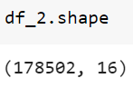

Fonte: Material produzido pelos autores(2023)

  3. IM_Cedente_230626_semNP

Essa tabela contém os dados que descrevem os maiores cedentes do fundo. 

Figura 11: Quantidade de linhas e colunas da Tabela IM_Cedentes_230626_semNP

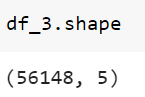

Fonte: Material produzido pelos autores(2023)

Ao todo, quantifica-se 291951 linhas e 342 colunas. 

a) Identificação das colunas numéricas e categóricas

**IM_230626_semNP**

Numérico (308 colunas):
 ID_Participante
 ID_Documento
 CNPJ
 CNPJ_Administrador
 Prazo_Conversao_Cotas
 Prazo_Pagamento_Resgate
 Ativo
 Ativo_Disponibilidades
 Ativo_Carteira
 Ativo_Direitos_Aquisicao
 Ativo_Direitos_Aquisicao_Creditos_Vencer_Adimplentes
 Ativo_Direitos_Aquisicao_Creditos_Vencer_Inadimplentes
 Ativo_Direitos_Aquisicao_Parcelas_Inadimplentes
 Ativo_Direitos_Aquisicao_Creditos_Inadimplentes
 Ativo_Direitos_Aquisicao_Creditos_Performar
 Ativo_Direitos_Aquisicao_Creditos_Vencidos_Pendentes
 Ativo_Direitos_Aquisicao_Creditos_Empresas_Recuperacao
 Ativo_Direitos_Aquisicao_Creditos_Receitas_Publicas
 Ativo_Direitos_Aquisicao_Creditos_Acoes_Judiciais
 Ativo_Direitos_Aquisicao_Creditos_Fator_Risco
 Ativo_Direitos_Aquisicao_Creditos_Diversos
 Ativo_Direitos_Aquisicao_Provisao_Reducao
 Ativo_Direitos_Sem_Aquisicao
 Ativo_Direitos_Sem_Aquisicao_Creditos_Vencer_Adimplentes
 Ativo_Direitos_Sem_Aquisicao_Creditos_Vencer_Inadimplentes
 Ativo_Direitos_Sem_Aquisicao_Parcelas_Inadimplentes
 Ativo_Direitos_Sem_Aquisicao_Creditos_Inadimplentes
 Ativo_Direitos_Sem_Aquisicao_Creditos_Performar
 Ativo_Direitos_Sem_Aquisicao_Creditos_Vencidos_Pendentes
 Ativo_Direitos_Sem_Aquisicao_Creditos_Empresas_Recuperacao
 Ativo_Direitos_Sem_Aquisicao_Creditos_Receitas_Publicas
 Ativo_Direitos_Sem_Aquisicao_Creditos_Acoes_Judiciais
 Ativo_Direitos_Sem_Aquisicao_Creditos_Fator_Risco
 Ativo_Direitos_Sem_Aquisicao_Creditos_Diversos
 Ativo_Direitos_Sem_Aquisicao_Provisao_Reducao
 Ativo_Valores_Mobiliarios
 Ativo_Debentures
 Ativo_CRI
 Ativo_Notas_Promissorias
 Ativo_Letras Financeiras
 Ativo_Cotas_Fundos_ICVM_555
 Ativo_Outros_Valores_Mobiliarios
 Ativo_Titulos_Federais
 Ativo_CDB
 Ativo_Operacoes_Compromissadas
 Ativo_Outros_Ativos_Renda_Fixa
 Ativo_Cotas_FIDC
 Ativo_Cotas_FIDC_NP
 Ativo_Warrants
 Ativo_Provisao_Debentures_CRI_NP_LF
 Ativo_Provisao_Cotas_FIDC
 Ativo_Provisao_Outros_Ativos
 Ativo_Posicao_Derivativos
 Ativo_Mercado_Termo
 Ativo_Mercado_Opcoes
 Ativo_Mercado_Futuro
 Ativo_Diferencial_Swap
 Ativo_Coberturas_Prestadas
 Ativo_Depositos_Margem
 Ativo_Outros
 Ativo_Curto_Prazo
 Ativo_Longo Prazo
 Carteira
 Carteira_Industrial
 Carteira_Mercado_Imobiliario
 Carteira_Comercial_Total
 Carteira_Comercial
 Carteira_Comercial_Varejo
 Carteira_Arrendamento_Mercantil
 Carteira_Servicos_Total
 Carteira_Servicos
 Carteira_Servicos_Publicos
 Carteira_Servicos_Educacionais
 Carteira_Entretenimento
 Carteira_Agronegocio
 Carteira_Financeiro
 Carteira_Credito Pessoal
 Carteira_Credito_Pessoal_Consignado
 Carteira_Credito_Corporativo
 Carteira_Middle_Market
 Carteira_Veiculos
 Carteira_Imobiliaria_Empresarial
 Carteira_Imobiliaria_Residencial
 Carteira_Outros_Financeiro
 Carteira_Cartao_Credito
 Carteira_Factoring
 Carteira_Factoring_Pessoal
 Carteira_Factoring_Corporativo
 Carteira_Setor_Publico
 Carteira_Precatorios
 Carteira_Creditos_Tributarios
 Carteira_Royalties
 Carteira_Outros_Setor_Publico
 Carteira_Acoes_Judiciais
 Carteira_Propriedade_Intelectual
 Passivo
 Passivo_A_Pagar
 Passivo_Curto_Prazo
 Passivo_Longo_Prazo
 Passivo_Posicao_Derivativos
 Passivo_Mercado_Termo
 Passivo_Mercado_Opcoes
 Passivo_Mercado_Futuro
 Passivo_Diferencial_Swap
 Patrimonio_Liquido
 Patrimonio_Liquido_Medio
 Carteira_Direitos_Aquisicao_Prazo
 Carteira_Direitos_Aquisicao_Prazo_1_30_dias
 Carteira_Direitos_Aquisicao_Prazo_31_60_Dias
 Carteira_Direitos_Aquisicao_Prazo_61_90_Dias
 Carteira_Direitos_Aquisicao_Prazo_91_120_Dias
 Carteira_Direitos_Aquisicao_Prazo_121_150_Dias
 Carteira_Direitos_Aquisicao_Prazo_151_180_Dias
 Carteira_Direitos_Aquisicao_Prazo_181_360_Dias
 Carteira_Direitos_Aquisicao_Prazo_361_720_Dias
 Carteira_Direitos_Aquisicao_Prazo_721_1080_Dias
 Carteira_Direitos_Aquisicao_Prazo_Acima_1080_Dias
 Carteira_Direitos_Aquisicao_Inadimplentes
 Carteira_Direitos_Aquisicao_Inadimplentes_1_30_Dias
 Carteira_Direitos_Aquisicao_Inadimplentes_31_60_Dias
 Carteira_Direitos_Aquisicao_Inadimplentes_61_90_Dias
 Carteira_Direitos_Aquisicao_Inadimplentes_91_120_Dias
 Carteira_Direitos_Aquisicao_Inadimplentes_121_150_Dias
 Carteira_Direitos_Aquisicao_Inadimplentes_151_180_Dias
 Carteira_Direitos_Aquisicao_Inadimplentes_181_360_Dias
 Carteira_Direitos_Aquisicao_Inadimplentes_361_720_Dias
 Carteira_Direitos_Aquisicao_Inadimplentes_721_1080_Dias
 Carteira_Direitos_Aquisicao_Inadimplentes_Acima_1080_Dias
 Carteira_Direitos_Aquisicao_Pagos
 Carteira_Direitos_Aquisicao_Pagos_1_30_Dias
 Carteira_Direitos_Aquisicao_Pagos_31_60_Dias
 Carteira_Direitos_Aquisicao_Pagos_61_90_Dias
 Carteira_Direitos_Aquisicao_Pagos_91_120_Dias
 Carteira_Direitos_Aquisicao_Pagos_121_150_Dias
 Carteira_Direitos_Aquisicao_Pagos_151_180_Dias
 Carteira_Direitos_Aquisicao_Pagos_181_360_Dias
 Carteira_Direitos_Aquisicao_Pagos_361_720_Dias
 Carteira_Direitos_Aquisicao_Pagos_721_1080_Dias
 Carteira_Direitos_Aquisicao_Pagos_Acima_1080_Dias
 Carteira_Direitos_Sem_Aquisicao_Prazo
 Carteira_Direitos_Sem_Aquisicao_Prazo_1_30_dias
 Carteira_Direitos_Sem_Aquisicao_Prazo_31_60_Dias
 Carteira_Direitos_Sem_Aquisicao_Prazo_61_90_Dias
 Carteira_Direitos_Sem_Aquisicao_Prazo_91_120_Dias
 Carteira_Direitos_Sem_Aquisicao_Prazo_121_150_Dias
 Carteira_Direitos_Sem_Aquisicao_Prazo_151_180_Dias
 Carteira_Direitos_Sem_Aquisicao_Prazo_181_360_Dias
 Carteira_Direitos_Sem_Aquisicao_Prazo_361_720_Dias
 Carteira_Direitos_Sem_Aquisicao_Prazo_721_1080_Dias
 Carteira_Direitos_Sem_Aquisicao_Prazo_Acima_1080_Dias
 Carteira_Direitos_Sem_Aquisicao_Inadimplentes
 Carteira_Direitos_Sem_Aquisicao_Inadimplentes_1_30_Dias
 Carteira_Direitos_Sem_Aquisicao_Inadimplentes_31_60_Dias
 Carteira_Direitos_Sem_Aquisicao_Inadimplentes_61_90_Dias
 Carteira_Direitos_Sem_Aquisicao_Inadimplentes_91_120_Dias
 Carteira_Direitos_Sem_Aquisicao_Inadimplentes_121_150_Dias
 Carteira_Direitos_Sem_Aquisicao_Inadimplentes_151_180_Dias
 Carteira_Direitos_Sem_Aquisicao_Inadimplentes_181_360_Dias
 Carteira_Direitos_Sem_Aquisicao_Inadimplentes_361_720_Dias
 Carteira_Direitos_Sem_Aquisicao_Inadimplentes_721_1080_Dias
 Carteira_Direitos_Sem_Aquisicao_Inadimplentes_Acima_1080_Dias
 Carteira_Direitos_Sem_Aquisicao_Pagos
 Carteira_Direitos_Sem_Aquisicao_Pagos_1_30_Dias
 Carteira_Direitos_Sem_Aquisicao_Pagos_31_60_Dias
 Carteira_Direitos_Sem_Aquisicao_Pagos_61_90_Dias
 Carteira_Direitos_Sem_Aquisicao_Pagos_91_120_Dias
 Carteira_Direitos_Sem_Aquisicao_Pagos_121_150_Dias
 Carteira_Direitos_Sem_Aquisicao_Pagos_151_180_Dias
 Carteira_Direitos_Sem_Aquisicao_Pagos_181_360_Dias
 Carteira_Direitos_Sem_Aquisicao_Pagos_361_720_Dias
 Carteira_Direitos_Sem_Aquisicao_Pagos_721_1080_Dias
 Carteira_Direitos_Sem_Aquisicao_Pagos_Acima_1080_Dias
 Negocios_Aquisicoes_Direitos_Aquisicao_Quantidade
 Negocios_Aquisicoes_Direitos_Aquisicao_Valor
 Negocios_Aquisicoes_Direitos_Sem_Aquisicao_Quantidade
 Negocios_Aquisicoes_Direitos_Sem_Aquisicao_Valor
 Negocios_Aquisicoes_Direitos_Vencer_Parcelas_Adimplentes_Quantidade
 Negocios_Aquisicoes_Direitos_Vencer_Parcelas_Adimplentes_Valor
 Negocios_Aquisicoes_Direitos_Vencer_Parcelas_Inadimplentes_Quantidade
 Negocios_Aquisicoes_Direitos_Vencer_Parcelas_Inadimplentes_Valor
 Negocios_Aquisicoes_Direitos_Inadimplentes_Quantidade
 Negocios_Aquisicoes_Direitos_Inadimplentes_Valor
 Negocios_Alienacoes_Cedente_Quantidade
 Negocios_Alienacoes_Cedente_Valor
 Negocios_Alienacoes_Cedente_Valor_Contabil
 Negocios_Alienacoes_Prestadores_Quantidade
 Negocios_Alienacoes_Prestadores_Valor
 Negocios_Alienacoes_Prestadores_Valor_Contabil
 Negocios_Alienacoes_Terceiros_Quantidade
 Negocios_Alienacoes_Terceiros_Valor
 Negocios_Alienacoes_Terceiros_Valor_Contabil
 Negocios_Substituicoes_Quantidade
 Negocios_Substituicoes_Valor
 Negocios_Substituicoes_Valor_Contabil
 Negocios_Recompras_Quantidade
 Negocios_Recompras_Valor
 Negocios_Recompras_Valor_Contabil
 Taxas_Direitos_Aquisicao_Desconto_Compra_Minina
 Taxas_Direitos_Aquisicao_Desconto_Venda_Minina
 Taxas_Direitos_Aquisicao_Desconto_Venda_Media_Ponderada
 Taxas_Direitos_Aquisicao_Desconto_Venda_Maxima
 Taxas_Direitos_Aquisicao_Juros_Compra_Minina
 Taxas_Direitos_Aquisicao_Juros_Compra_Media_Ponderada
 Taxas_Direitos_Aquisicao_Juros_Compra_Maxima
 Taxas_Direitos_Aquisicao_Juros_Venda_Minina
 Taxas_Direitos_Aquisicao_Juros_Venda_Media_Ponderada
 Taxas_Direitos_Aquisicao_Juros_Venda_Maxima
 Taxas_Direitos_Sem_Aquisicao_Desconto_Compra_Minina
 Taxas_Direitos_Sem_Aquisicao_Desconto_Compra_Media_Ponderada
 Taxas_Direitos_Sem_Aquisicao_Desconto_Compra_Maxima
 Taxas_Direitos_Sem_Aquisicao_Desconto_Venda_Minina
 Taxas_Direitos_Sem_Aquisicao_Desconto_Venda_Media_Ponderada
 Taxas_Direitos_Sem_Aquisicao_Desconto_Venda_Maxima
 Taxas_Direitos_Sem_Aquisicao_Juros_Compra_Minina
 Taxas_Direitos_Sem_Aquisicao_Juros_Compra_Media_Ponderada
 Taxas_Direitos_Sem_Aquisicao_Juros_Compra_Maxima
 Taxas_Direitos_Sem_Aquisicao_Juros_Venda_Minina
 Taxas_Direitos_Sem_Aquisicao_Juros_Venda_Media_Ponderada
 Taxas_Direitos_Sem_Aquisicao_Juros_Venda_Maxima
 Taxas_Valores_Mobiliarios_Desconto_Compra_Minina
 Taxas_Valores_Mobiliarios_Desconto_Compra_Media_Ponderada
 Taxas_Valores_Mobiliarios_Desconto_Compra_Maxima
 Taxas_Valores_Mobiliarios_Desconto_Venda_Minina
 Taxas_Valores_Mobiliarios_Desconto_Venda_Media_Ponderada
 Taxas_Valores_Mobiliarios_Desconto_Venda_Maxima
 Taxas_Valores_Mobiliarios_Juros_Compra_Minina
 Taxas_Valores_Mobiliarios_Juros_Compra_Media_Ponderada
 Taxas_Valores_Mobiliarios_Juros_Compra_Maxima
 Taxas_Valores_Mobiliarios_Juros_Venda_Minina
 Taxas_Valores_Mobiliarios_Juros_Venda_Media_Ponderada
 Taxas_Valores_Mobiliarios_Juros_Venda_Maxima
 Taxas_Titulos_Federais_Desconto_Compra_Minina
 Taxas_Titulos_Federais_Desconto_Compra_Media_Ponderada
 Taxas_Titulos_Federais_Desconto_Compra_Maxima
 Taxas_Titulos_Federais_Desconto_Venda_Minina
 Taxas_Titulos_Federais_Desconto_Venda_Media_Ponderada
 Taxas_Titulos_Federais_Desconto_Venda_Maxima
 Taxas_Titulos_Federais_Juros_Compra_Minina
 Taxas_Titulos_Federais_Juros_Compra_Media_Ponderada
 Taxas_Titulos_Federais_Juros_Compra_Maxima
 Taxas_Titulos_Federais_Juros_Venda_Minina
 Taxas_Titulos_Federais_Juros_Venda_Media_Ponderada
 Taxas_Titulos_Federais_Juros_Venda_Maxima
 Taxas_CDB_Desconto_Compra_Minina
 Taxas_CDB_Desconto_Compra_Media_Ponderada
 Taxas_CDB_Desconto_Compra_Maxima
 Taxas_CDB_Desconto_Venda_Minina
 Taxas_CDB_Desconto_Venda_Media_Ponderada
 Taxas_CDB_Desconto_Venda_Maxima
 Taxas_CDB_Juros_Compra_Minina
 Taxas_CDB_Juros_Compra_Media_Ponderada
 Taxas_CDB_Juros_Compra_Maxima
 Taxas_CDB_Juros_Venda_Minina
 Taxas_CDB_Juros_Venda_Media_Ponderada
 Taxas_CDB_Juros_Venda_Maxima
 Taxas_Renda_Fixa_Desconto_Compra_Minina
 Taxas_Renda_Fixa_Desconto_Compra_Media_Ponderada
 Taxas_Renda_Fixa_Desconto_Compra_Maxima
 Taxas_Renda_Fixa_Desconto_Venda_Minina
 Taxas_Renda_Fixa_Desconto_Venda_Media_Ponderada
 Taxas_Renda_Fixa_Desconto_Venda_Maxima
 Taxas_Renda_Fixa_Juros_Compra_Minina
 Taxas_Renda_Fixa_Juros_Compra_Media_Ponderada
 Taxas_Renda_Fixa_Juros_Compra_Maxima
 Taxas_Renda_Fixa_Juros_Venda_Minina
 Taxas_Renda_Fixa_Juros_Venda_Media_Ponderada
 Taxas_Renda_Fixa_Juros_Venda_Maxima
 Numero_Cotistas_Senior_Pessoa_Fisica
 Numero_Cotistas_Senior_Pessoa_Juridica_Nao_Financeira
 Numero_Cotistas_Senior_Banco_Comercial
 Numero_Cotistas_Senior_Corretora_Distribuidora
 Numero_Cotistas_Senior_Pessoa_Juridica_Financeira
 Numero_Cotistas_Senior_Investidor_Nao_Residente
 Numero_Cotistas_Senior_Entidade_Aberta_Previdencia_Complementar
 Numero_Cotistas_Senior_Entidade_Fechada_Previdencia_Complementar
 Numero_Cotistas_Senior_Regime_Proprio_Previdencia_Servidores_Publicos
 Numero_Cotistas_Senior_Sociedade_Seguradora
 Numero_Cotistas_Senior_Sociedade_Capitalizacao
 Numero_Cotistas_Senior_FIC_FIDC
 Numero_Cotistas_Senior_FII
 Numero_Cotistas_Senior_Outros_Fundos
 Numero_Cotistas_Senior_Clube_Investimento
 Numero_Cotistas_Senior_Outros
 Numero_Cotistas_Subordinada_Pessoa_Fisica
 Numero_Cotistas_Subordinada_Pessoa_Juridica_Nao_Financeira
 Numero_Cotistas_Subordinada_Banco_Comercial
 Numero_Cotistas_Subordinada_Corretora_Distribuidora
 Numero_Cotistas_Subordinada_Pessoa_Juridica_Financeira
 Numero_Cotistas_Subordinada_Investidor_Nao_Residente
 Numero_Cotistas_Subordinada_Entidade_Aberta_Previdencia_Complementar
 Numero_Cotistas_Subordinada_Entidade_Fechada_Previdencia_Complementar
 Numero_Cotistas_Subordinada_Regime_Proprio_Previdencia_Servidores_Publicos
 Numero_Cotistas_Subordinada_Sociedade_Seguradora
 Numero_Cotistas_Subordinada_Sociedade_Capitalizacao
 Numero_Cotistas_Subordinada_FIC_FIDC
 Numero_Cotistas_Subordinada_FII
 Numero_Cotistas_Subordinada_Outros_Fundos
 Numero_Cotistas_Subordinada_Clube_Investimento
 Numero_Cotistas_Subordinada_Outros
 Liquidez_Imediata
 Liquidez_Ate_30_Dias
 Liquidez_Ate_60_Dias
 Liquidez_Ate_90_Dias
 Liquidez_Ate_180_Dias
 Liquidez_Ate_360_Dias
 Liquidez_Acima_360_Dias
 Garantias_Valor_Total
 Garantias_Percentual

 Categórico (13 colunas):
 SK_Documento
  Data_Competencia
  Data_Entrega
  Nome_Administrador
  Forma_Condominio
  Fundo_Exclusivo
  Cotistas_Vinculados_Interesse
  Tipo_Prazo_Conversao_Cotas
  Tipo_Prazo_Pagamento_Resgate
  Taxas_Direitos_Aquisicao_Desconto_Compra_Media_Ponderada
  Taxas_Direitos_Aquisicao_Desconto_Compra_Maxima
  Sistema_Origem
  Nome_Fundo

**IM_Classes_230626_semNP**

Numérico (14 colunas):
  Numero_Cotistas
  Quantidade_Cotas
  Valor_Cota
  Rentabilidade
  Valor_Total_Captado
  Quantidade_Cotas_Emitidas
  Valor_Total_Resgates
  Quantidade_Cotas_Resgatadas
  Valor_A_Pagar
  Quantidade_Cotas_A_Resgatar
  Valor_Amortizado_Cota
  Valor_Total_Amortizacao
  Desempenho_Esperado
  Desempenho_Realizado

Categórico (2 colunas):
  SK_Documento
  Classe_Serie

**IM_Cedente_230626_semNP**

Numérico (3 colunas):
  Sequencial
  CPF_CNPJ_Cedente
  Participacao_Percentual

Categórico (2 colunas):
  SK_Documento
  Item

b) Estatística descritiva das colunas

&emsp;&emsp;Visando tornar a análise mais assertiva e organizada, realizamos o processo de análise descritiva em uma tabela por vez. Contudo, o grupo optou por não utilizar a tabela M_Cedente_230626_semNP, pois continha muitos dados nulos e zerados. O que resulta em perda de informações, vieses e influencia a própria estatística descritiva, como a média, mediana e o desvio padrão, gerando dados distorcidos.

Para a visualização das tabelas pela ferramenta Colab, nos apropriamos da função 'read' do pandas.  

Figura 12: Visualização das tabelas

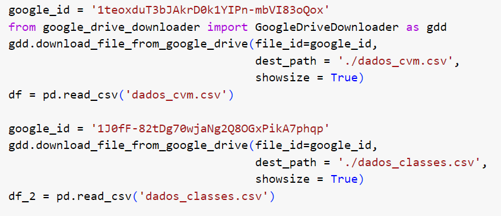

Fonte: Material produzido pelos autores(2023)

&emsp;&emsp;Após a visualização, inicia-se o processo de estatística descritiva. A primeira etapa é utilizar a função shape para identificar as linhas e colunas do dataframe. Como esse procedimento já foi realizado anteriormente, pode-se passar para a segunda etapa, ou seja, a utilização da função info() para visualizar os nomes das colunas e identificar os seus tipos (int, float ou object). 

Figura 13: Função info() aplicada na Tabela IM_230626_semNP

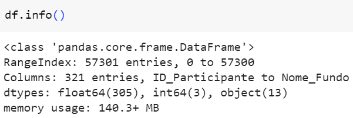

Fonte: Material produzido pelos autores(2023)

Figura 14: Função info() aplicada na Tabela IM_Classes_230626_semNP

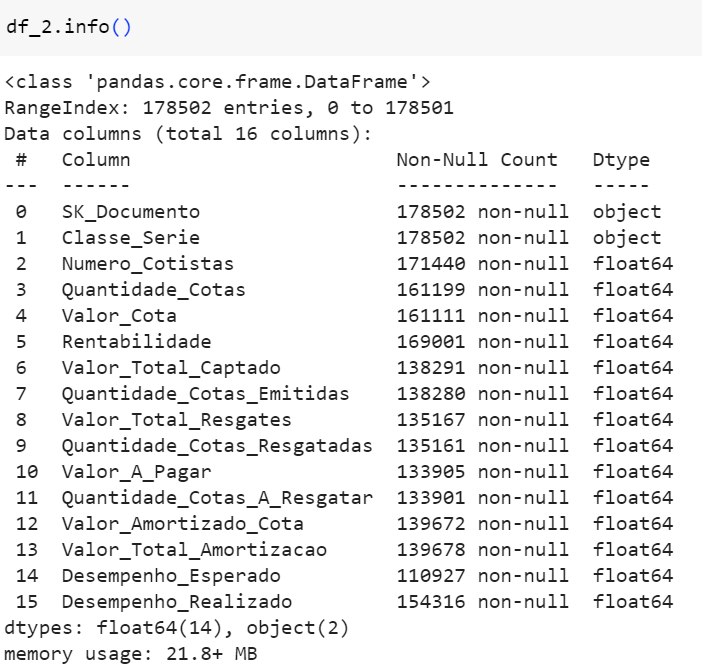
 
Fonte: Material produzido pelos autores(2023)

&emsp;&emsp;Pode-se observar que a Tabela IM_230626_semNP contém 305 colunas do tipo float, 3 do tipo int e 13 do tipo objeto. Já a Tabela IM_Classes_230626_semNP é majoritariamente constituída de 14 colunas do tipo float e 2 colunas do tipo objeto. Desta forma, temos poucos objetos para realizar a conversão de dado categórico para numérico através das variáveis dummy, ou seja, variáveis binárias. 
 
Por último, aplicou-se a função describe() a fim de demonstrar as estatísticas descritivas.

Figura 15: Função describe() aplicada na Tabela IM_230626_semNP

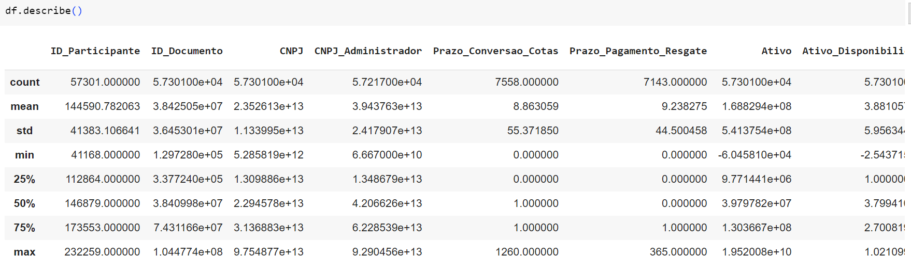

Fonte: Material produzido pelos autores(2023)

Figura 16: Função describe() aplicada na Tabela IM_Classes_230626_semNP

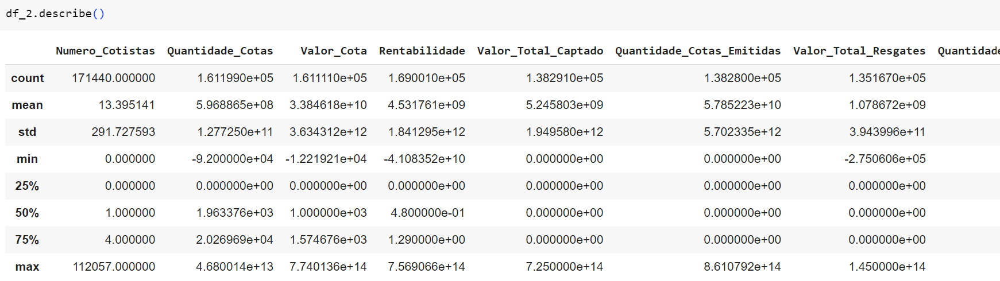

Fonte: Material produzido pelos autores(2023)

&emsp;&emsp;A função describe() demonstra, respectivamente, a quantidade de elementos na coluna, a média, o desvio padrão, valor mínimo da coluna, percentis de 25%, 50% (representa a mediana) e 75%, e o valor máximo da coluna. 

&emsp;&emsp;De acordo com os dados obtidos utilizando as funções acima nas figuras 15 e 16, é possível identificar as colunas que serão mais proveitosas para o trabalho, entendendo a necessidade de valores válidos preenchidos. 

Sendo assim, as colunas mais relevantes são:
 Data_Entrega
 Ativo
 Passivo
 Patrimonio_Liquido
 Nome_Fundo
 Negocios_Recompras_Quantidade
 Negocios_Recompras_Valor
 Negocios_Recompras_Valor_Contabil
 Ativo_Direitos_Aquisicao_Parcelas_Inadimplentes
 Ativo_Direitos_Aquisicao_Creditos_Inadimplentes
 Carteira_Direitos_Aquisicao_Inadimplentes_1_30_Dias
 Ativo_Direitos_Aquisicao_Provisao_Reducao
 Ativo_Direitos_Sem_Aquisicao_Parcelas_Inadimplentes
 Ativo_Direitos_Sem_Aquisicao_Creditos_Inadimplentes
 Carteira_Direitos_Sem_Aquisicao_Inadimplentes_1_30_Dias
 Ativo_Direitos_Sem_Aquisicao_Provisao_Reducao
 Negocios_Substituicoes_Quantidade
 Negocios_Substituicoes_Valor
 Negocios_Substituicoes_Valor_Contabil
 Ativo_Direitos_Aquisicao_Creditos_Vencer_Adimplentes
 Ativo_Direitos_Sem_Aquisicao_Creditos_Vencer_Adimplentes
 Carteira_Direitos_Aquisicao_Inadimplentes
 Carteira_Direitos_Sem_Aquisicao_Inadimplentes
 Rentabilidade
 Desempenho_Esperado
 Desempenho_Realizado
 vr_risco
 vr_s_risco

##### 4.2.1.1. Conclusão análise de dados

&emsp;&emsp;Durante a análise realizada, o ponto de partida consistiu na avaliação da quantidade de fundos abertos e fechados, bem como suas tendências comportamentais correspondentes.

&emsp;&emsp;Na investigação sobre a quantidade de fundos classificados como condomínios fechados e abertos, emergiu uma conclusão notável: os fundos de condomínio fechado apresentam uma presença quase três vezes maior em relação aos de condomínio aberto.

&emsp;&emsp;No contexto dos Condomínios Abertos, os fundos de investimento se configuram como veículos de investimento que permitem a entrada e saída de investidores a qualquer momento, conferindo uma flexibilidade notável.

Contrastando essa dinâmica, os Condomínios Fechados se caracterizam por possuírem um número limitado de cotas disponíveis. A emissão e resgate de cotas nesses fundos não se dá com a mesma agilidade encontrada nos fundos abertos.

&emsp;&emsp;Além disso, procedeu-se à análise do comportamento das diferentes categorias de fundos em relação ao Valor em Risco, tanto considerando riscos e benefícios quanto desprezando esses elementos. Tais insights foram ilustrados nos gráficos subsequentes.

&emsp;&emsp;Após minuciosa avaliação dos tipos de fundos e suas reações, concluiu-se que o tipo de fundo não mantém qualquer interferência ou relação direta com a manifestação do Valor em Risco, quer seja contemplando riscos e benefícios, quer seja apenas considerando o valor em risco de forma isolada. Essa conclusão foi alcançada devido à ausência de qualquer padrão consistente de correlação entre os fatores em questão.Desta forma, a análise não apenas fornece uma compreensão mais profunda da paisagem dos fundos de investimento, mas também evidencia a complexidade das interações entre os diferentes aspectos examinados.

Figura 17: Quantidade de fundos abertos e fechados

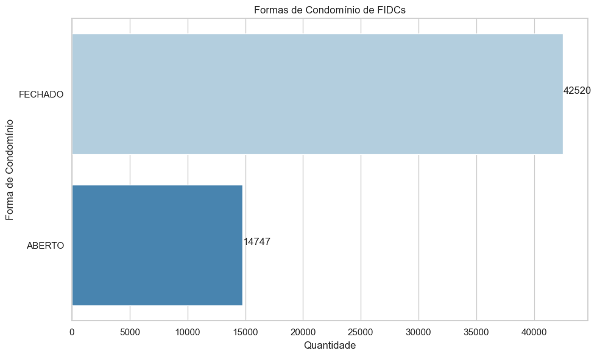

Fonte: Material produzido pelos autores(2023)

Figura 18: VR do DC com risco e benefícios nos tipos de condomínio

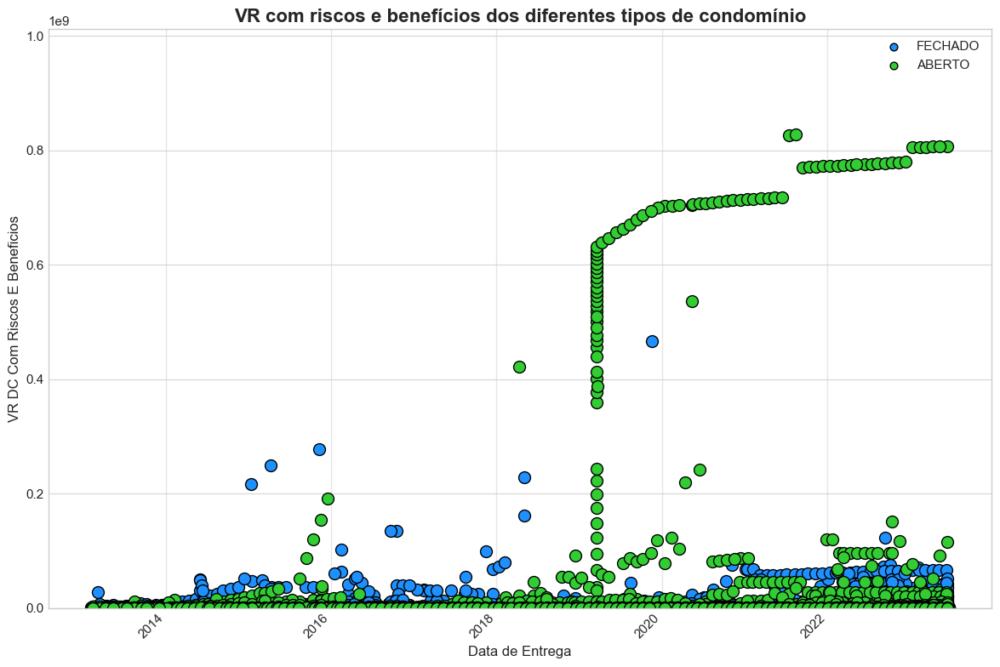

Fonte: Material produzido pelos autores(2023)

Figura 19: VR do DC sem risco e benefícios nos tipos de condomínio

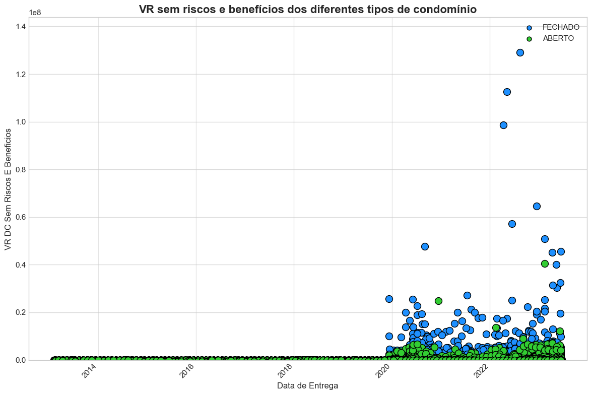

Fonte: Material produzido pelos autores(2023)

&emsp;&emsp;Uma investigação adicional foi conduzida com foco nas correlações das variáveis propostas pelo parceiro de projeto. Nesse sentido, passos específicos foram seguidos para uma análise mais profunda. Inicialmente, ocorreu uma criteriosa seleção das variáveis relevantes. Posteriormente, essa seleção serviu como base para a criação de uma matriz de correlação. O objetivo principal desse procedimento foi identificar eventuais associações robustas entre as variáveis, delineando conexões substanciais que pudessem influenciar os resultados.

Figura 20: Matriz de correlação das variáveis

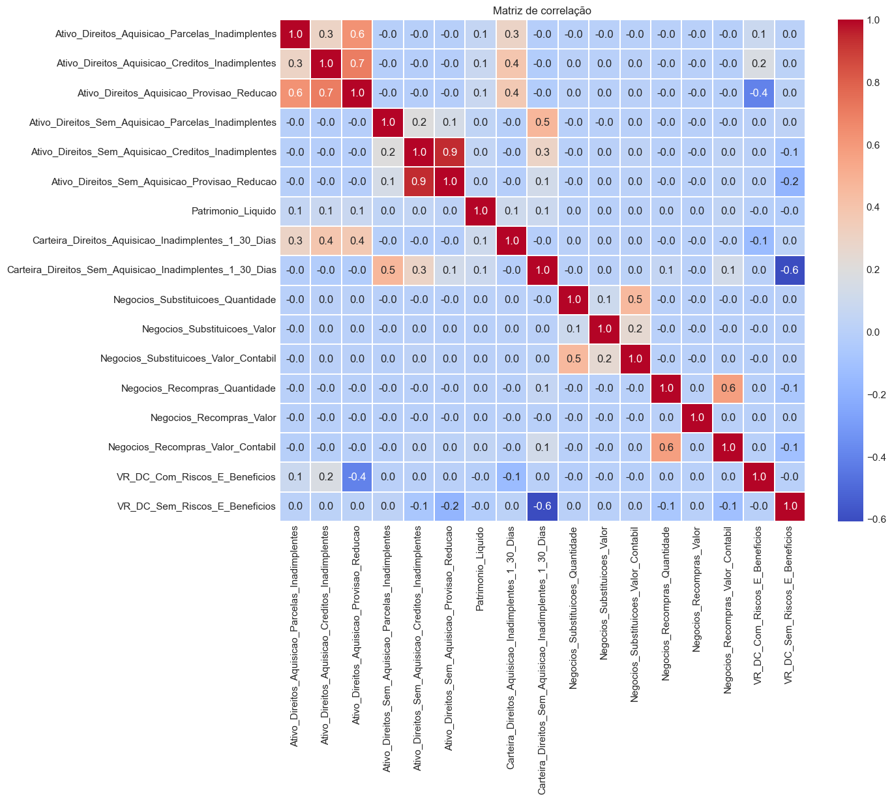

Fonte: Material produzido pelos autores(2023)

&emsp;&emsp;Além disso, uma análise crucial realizada durante essa etapa centrou-se nos fundos que se classificaram como fechados ou que apresentaram algum tipo de problema. Foi executada uma minuciosa avaliação do comportamento desses fundos ao longo do tempo, com um enfoque específico nos indicadores de Valor em Risco, tanto considerando os riscos e benefícios associados, quanto avaliando o Valor em Risco desconsiderando esses elementos adicionais.

Figura 21: VR do DC com risco e benefícios nos fundos fechados/com problemas

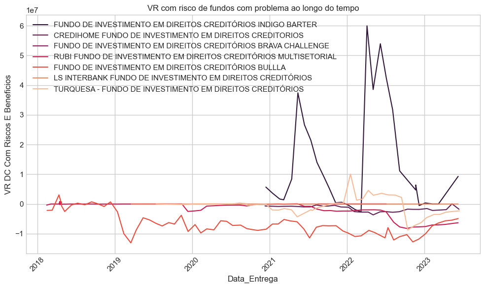

Fonte: Material produzido pelos autores(2023)

Figura 22: VR do DC sem risco e benefícios nos fundos fechados/com problemas

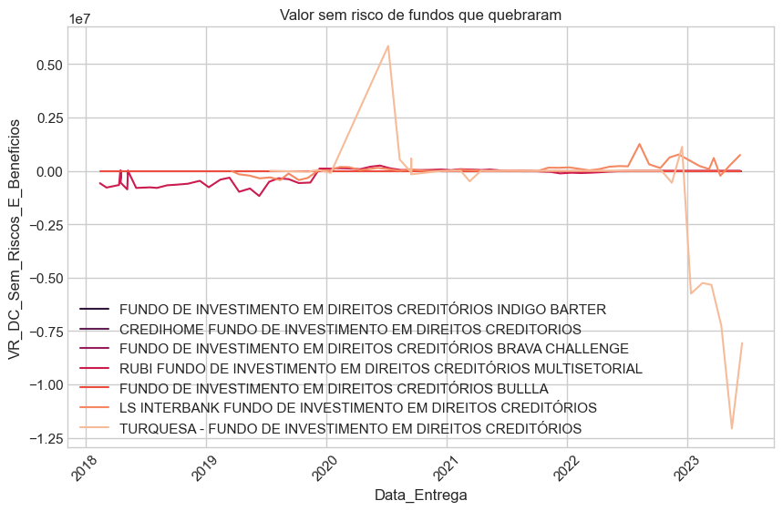

Fonte: Material produzido pelos autores(2023)

### 4.2.2. Pré-processamento dos dados
&emsp;&emsp;O grupo Verum realizou a identificação dos missing (dados faltantes) por meio do Orange Data Mining, que é uma ferramenta de visualização de dados, aprendizado de máquinas e mineração, o qual nos apresentou a porcentagem de valores nulos em cada variável, tal como a seguinte imagem 23:

Figura 23: Identificação do missing no Orange

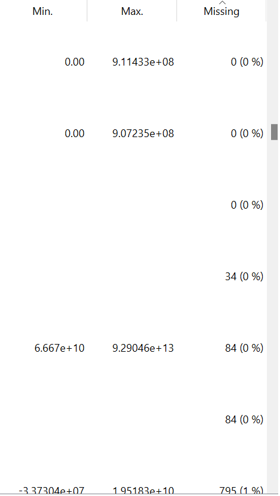

Fonte: Material produzido pelos autores(2023)

&emsp;&emsp;Por meio dessa informação, selecionamos todas as colunas que possuem missing utilizando um filtro e as apagamos do banco. Sendo assim, antes do tratamento tínhamos 335 colunas, nesse momento ficamos com 290, ou seja, 45 foram removidas. Logo após, verificamos se haviam colunas com valores repetidos e as excluímos, ficando com 245. Além dessas ações, foi preciso remover as variáveis irrelevantes para o projeto e juntar os ativos, o que nos fez ter ao final da limpagem
87 colunas.

&emsp;&emsp;Além disso, como não encontramos um Target ou uma correlação forte durante a segunda Sprint, não foi possível realizar a remoção dos outliers, pois ainda não possuímos uma base para o nosso projeto. Entretanto, essa etapa será feita futuramente, para não corrermos o risco de remover algum dado importante para o modelo.

&emsp;&emsp;Ademais, para a codificação das colunas categóricas e normalização das variáveis numéricas, criamos uma variável chamada “df_cats” para selecionar e armazenar todas as variáveis categóricas, a qual a quantidade está demonstrada na seguinte tabela:

| Dataset  | Numéricas     | Categóricas | 
|--------------|-----------|------------|
| IM_230626_semNP  |  308      | 13        |
| IM_Classes_230626_semNP    | 14  | 2       |
| IM_230626_semNP | 3      | 2        |

&emsp;&emsp;Entretanto, essa variável nos mostrou que existiam diversos NaN (Not a Number) nas colunas e diversos números zerados no arquivo CSV, o que nos fez utilizar somente o Dataset "IM_230626_semNP", visto que era o único com maior quantidade de dados disponibilizados e que não fossem nulos. Posto isso, aplicamos a função dropna(), da biblioteca Pandas, cujo objetivo é realizar a remoção desses valores ausentes para fazer mais uma limpeza. 
Logo em seguida, a fim de finalizar o processo de codificação e normalização, usamos outra função do pandas, get_dummies, a qual transformou cada variável categórica em colunas, criando variáveis fictícias, com linhas indicando zero( 0 - ausência de uma categoria) ou um (1 - presença de uma categoria).

#### 4.2.3. Hipóteses
&emsp;&emsp;Antes de mergulharmos nas hipóteses que conectam os dados ao problema específico dos Fundos de Investimento em Direitos Creditórios (FIDCs) e sua relação com a Valor de Risco (VR), é vital elucidar o conceito de hipótese, seu papel no desenvolvimento de modelos preditivos e sua influência na tomada de decisões.

&emsp;&emsp;Uma hipótese, no âmbito analítico, é uma suposição fundamentada que serve como ponto de partida para uma investigação mais profunda. É uma conjectura educada, baseada em observações iniciais e conhecimento prévio, que busca explicar um fenômeno ou estabelecer uma relação entre variáveis. Hipóteses são essenciais para orientar pesquisas e análises, direcionando a coleta de dados e permitindo testar empiricamente a validade das suposições feitas.

&emsp;&emsp;No contexto de modelos preditivos, as hipóteses desempenham um papel crucial. Ao desenvolver um modelo preditivo, é necessário criar uma estrutura que relacione as variáveis de entrada aos resultados desejados. As hipóteses ajudam a definir quais variáveis são relevantes, como elas se interconectam e qual impacto elas podem ter nos resultados. Elas fornecem um guia para a construção do modelo, permitindo selecionar as características mais significativas e, assim, aumentar a precisão e a eficácia das previsões.

&emsp;&emsp;Agora, considerando as hipóteses pertinentes ao projeto e sua interação com a Valor de Risco (VR), vamos aprofundar cada uma delas com argumentações mais detalhadas e justificativas substanciais.

- Hipótese 1: Impacto da Concentração de Cedentes na VR

&emsp;&emsp;A primeira hipótese pressupõe que uma maior concentração de cedentes nos FIDCs, conforme evidenciado nos campos I.a.12 e I.b.12, pode estar relacionada a um aumento gradual na Variação de Rentabilidade ao longo do tempo. A lógica subjacente é que uma concentração mais intensa de cedentes pode resultar em uma maior exposição a riscos específicos, o que, por sua vez, poderia amplificar a volatilidade da VR. Para confirmar ou refutar essa hipótese, seria imperativo analisar como a relação entre concentração e VR evolui ao longo dos meses, buscando padrões que indiquem a presença dessa associação.

- Hipótese 2: Substituições de Créditos e sua Influência na VR

&emsp;&emsp;A segunda hipótese argumenta que FIDCs que frequentemente realizam substituições de créditos, como indicado nos campos relacionados ao item VII.c, têm uma maior probabilidade de testemunhar um aumento subsequente na Variação de Rentabilidade. A base para essa suposição reside na premissa de que as substituições visam otimizar a qualidade da carteira, o que poderia potencialmente reforçar a VR. Entretanto, é fundamental examinar a eficácia dessas substituições ao longo do tempo, considerando os resultados em termos de retorno e risco dos novos créditos incorporados.

Figura 24: Substituições de crédito x VR Com riscos e benefícios
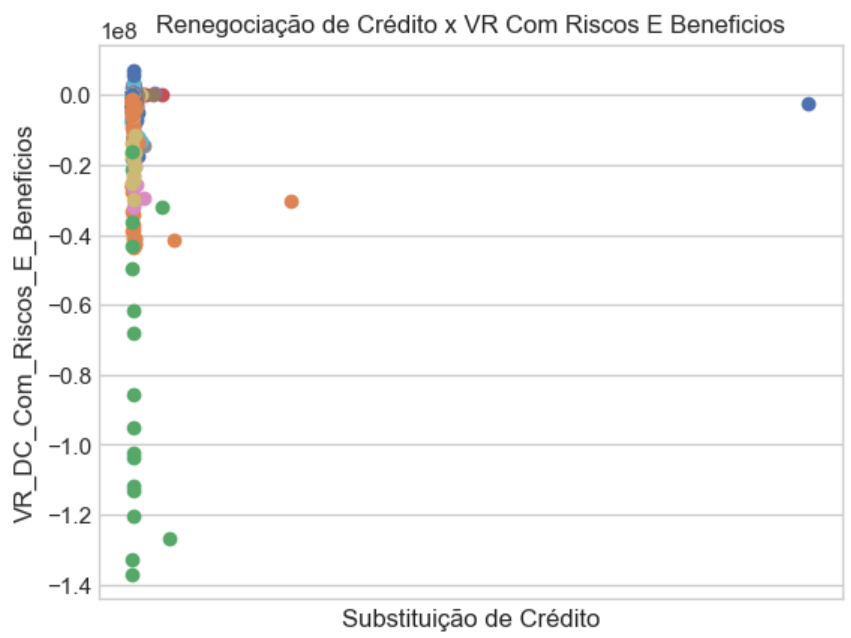
Fonte: Material produzido pelos autores(2023)

Figura 25: 5 Substituições de crédito x VR Sem riscos e benefícios
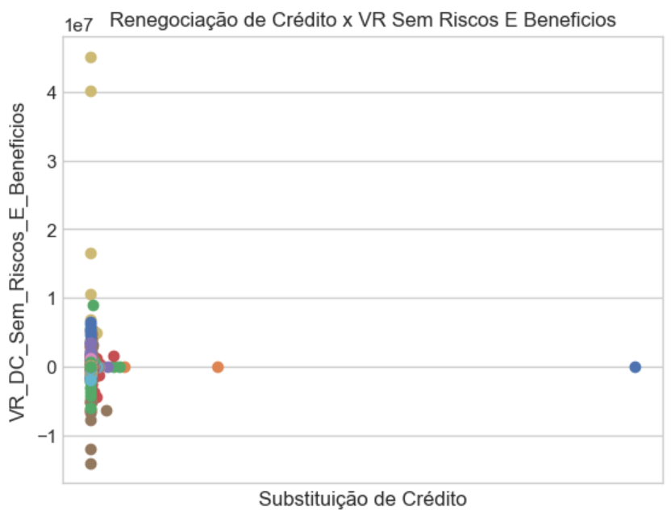
Fonte: Material produzido pelos autores(2023)

- Hipótese 3: Renegociações de Créditos e seu Impacto na VR

&emsp;&emsp;A terceira hipótese sugere que FIDCs que participam em renegociações de créditos estão mais suscetíveis a experimentar um aumento subsequente no Valor de Risco. Esta premissa decorre da ideia de que renegociações podem indicar uma administração pró-ativa dos riscos, o que, por sua vez, poderia influenciar positivamente a saúde geral do fundo e, consequentemente, sua performance. Todavia, é imperativo discernir quais tipos de renegociações têm o maior impacto no VR e como essa influência se manifesta ao longo do tempo.

&emsp;&emsp;É crucial reconhecer que essas hipóteses são construções educadas, moldadas pelo conhecimento atual e pelas informações disponíveis. Para desenvolver conclusões sólidas, é necessário expandir a análise para incluir uma gama mais ampla de dados e períodos mais abrangentes. Adicionalmente, a interdependência intrincada entre elementos nos FIDCs e as flutuações do mercado exige uma abordagem em camadas, combinando intuição teórica com observações práticas. A compreensão profunda das conexões entre os dados e o problema é alicerçada em uma investigação diligente e em um questionamento constante das hipóteses formuladas.

Figura 26: Renegociações de crédito x VR Com riscos e benefícios

Fonte: Material produzido pelos autores(2023)

Figura 27: Renegociações de crédito x VR Sem riscos e benefícios

Fonte: Material produzido pelos autores(2023)

## 4.3. Preparação dos Dados e Modelagem
&emsp;&emsp;O modelo escolhido pelo grupo foi o não-supervisionado, o qual, de acordo com o blog betrybe, “é uma forma em que o aprendizado de máquina ocorre de forma independente. Nesse caso, o algoritmo deve tentar entender a rotina por conta própria devido à ausência da rotulação de dados, ou seja, não é possível saber quais as saídas que o algoritmo terá.  Assim, o algoritmo em questão não passará por nenhum tipo de tratamento dos dados e deverá descobrir por si próprio as relações entre eles. Depois disso, ele verificará se há alguma equivalência com os dados para que eles sejam agrupados em clusterings”.

Ademais, o aprendizado não-supervisionado segue o seguinte fluxo:

Figura 28: Fluxograma do aprendizado não-supervisionado

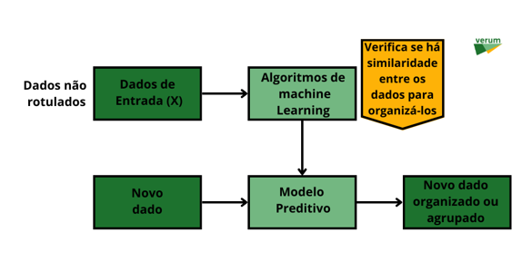

Fonte: Material produzido pelos autores(2023)

&emsp;&emsp;Além disso, realizamos uma análise do K-means, um algoritmo de clustering, o qual divide os dados em k grupos representados por um centróide (ponto médio de todos os pontos do grupo) de acordo com as suas similaridades, investigando 3 possíveis opções: k=3, k=4 e k=5, representados nas imagens a seguir:

Figura 29: K-means com o K = 3

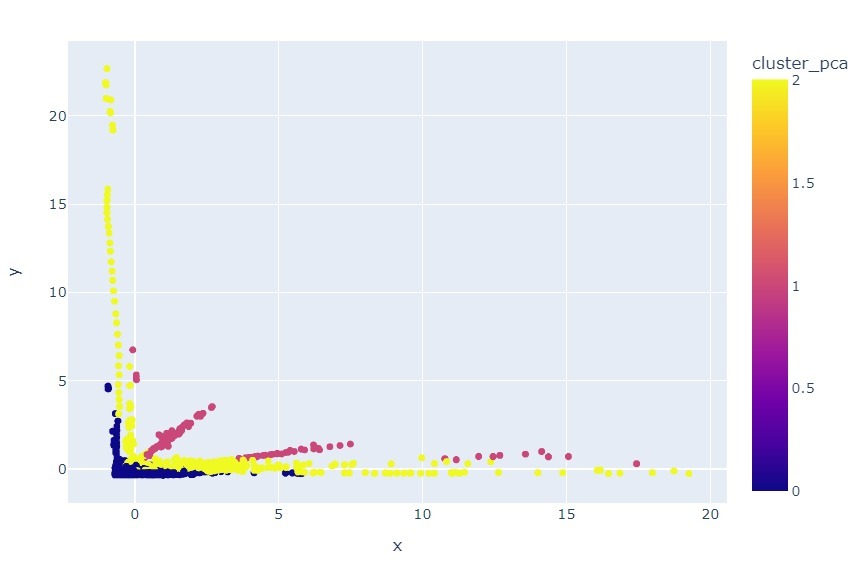

Fonte: Material produzido pelos autores(2023)

Figura 30: K-means com o K = 4

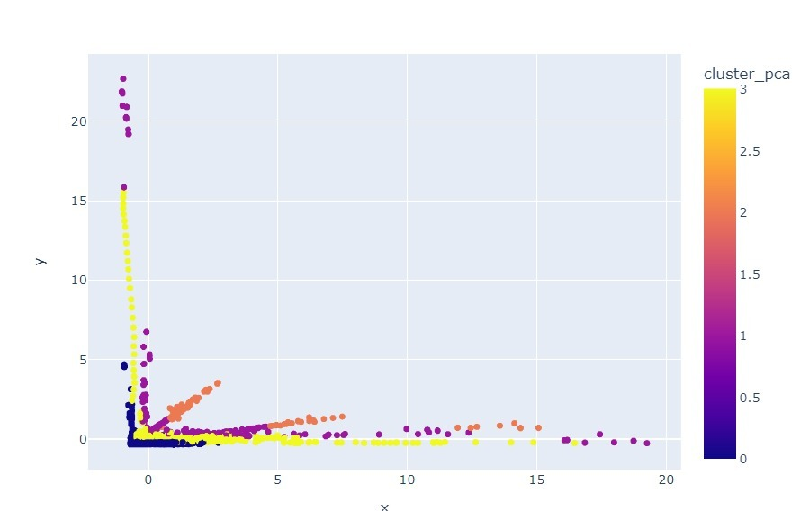

Fonte: Material produzido pelos autores(2023)

Figura 31: K-means com o K = 5

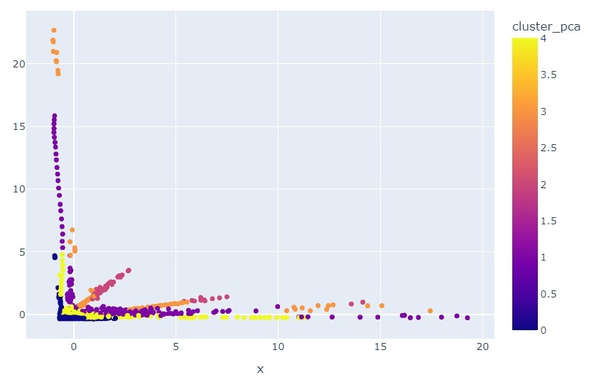

Fonte: Material produzido pelos autores(2023)

&emsp;&emsp;Sendo assim, após uma cuidadosa análise dos resultados obtidos, chegamos à conclusão de que o valor de K mais apropriado para o modelo é, indubitavelmente, 3. Essa escolha se fundamenta em observações detalhadas do processo de agrupamento, que revelaram que a partir desse ponto, a natureza dos agrupamentos deixou de apresentar coerência e relevância.

&emsp;&emsp;É crucial destacar que, à medida que K aumentava, notamos uma deterioração na capacidade do algoritmo em separar os dados em grupos significativos. Isso ficou evidenciado pelo fato de que os centróides começaram a ser posicionados em proximidade excessiva uns dos outros, comprometendo a qualidade dos agrupamentos formados. Essa proximidade inadequada entre os centróides, como pode ser claramente constatado nas imagens geradas durante o processo de análise, prejudicou a interpretação dos resultados.

&emsp;&emsp;Portanto, para manter a coerência e a utilidade das agrupações produzidas pelo modelo, optamos por estabelecer K como 3, garantindo assim uma separação mais clara e significativa dos dados em grupos distintos. Essa escolha baseia-se em princípios sólidos de análise de agrupamentos e contribuirá para uma compreensão mais precisa e útil dos dados em questão.

## 4.4. Comparação de Modelos
&emsp;&emsp;A comparação de modelos é uma etapa fundamental no processo de desenvolvimento de soluções baseadas em aprendizado de máquina e análise de dados. Ela desempenha um papel crucial na seleção do algoritmo ou modelo mais adequado para resolver um problema específico. Neste texto, exploraremos em detalhes a importância da comparação de modelos, os métodos envolvidos e como essa prática pode impactar significativamente os resultados e o sucesso de um projeto de análise de dados.

&emsp;&emsp;Além disso, sua importância reside a partir do momento que cada algoritmo ou modelo possui suas próprias características e pressupostos subjacentes. Alguns podem se destacar em determinados tipos de problemas, enquanto outros podem ser menos eficazes. A comparação de modelos permite identificar qual algoritmo tem o melhor desempenho para uma tarefa específica, otimizando assim o resultado final. A seleção do modelo adequado desde o início economiza recursos preciosos, como tempo de computação e custos de infraestrutura. Usar o modelo certo significa que você precisará de menos iterações de ajuste e validação, o que acelera o desenvolvimento e reduz os custos. Ao comparar modelos, é possível tomar decisões baseadas em evidências sólidas, em vez de escolher um modelo com base em suposições ou preferências pessoais. Essa abordagem baseada em dados aumenta a confiabilidade dos resultados e a confiança nas decisões tomadas.
Os modelos comparados no projeto presente são Kmeans, Dbscan, Minibatch Kmeans, MeanShift:

#### Kmeans:
- O primeiro algoritmo que foi explorado em nosso estudo foi o K-means, uma técnica amplamente utilizada em análise de dados e mineração de dados para a tarefa de clusterização. Este algoritmo é notável por sua eficácia na categorização de dados em grupos distintos, conhecidos como clusters. Um dos parâmetros cruciais para o sucesso do K-means é o número de clusters, que precisa ser especificado pelo usuário ou determinado de alguma forma apropriada ao contexto. O funcionamento do algoritmo K-means é relativamente simples, mas muito eficaz. Ele começa com a distribuição aleatória de centróides iniciais. Os centróides são pontos que representam o centro de cada cluster que o algoritmo está tentando encontrar. Em outras palavras, eles são como ímãs que atraem pontos de dados para se agruparem em torno deles. Em seguida, cada ponto de dados é designado ao centróide mais próximo, o que efetivamente o atribui a um cluster. Essa atribuição é feita com base na distância entre o ponto de dados e os centróides. Geralmente, a distância euclidiana é usada, mas outras métricas de distância também podem ser aplicadas, dependendo da natureza dos dados e do problema em questão. Após essa etapa de atribuição, ocorre a atualização dos centróides. Cada centróide é recalculado para se posicionar na posição média de todos os pontos de dados que foram atribuídos a ele. Esse novo posicionamento é o resultado de uma média ponderada das coordenadas dos pontos de dados dentro do cluster. Portanto, os centróides são ajustados para ficar no meio dos pontos de dados atribuídos a eles. O processo de atribuição e atualização de centróides é repetido iterativamente até que ocorra uma convergência. Isso significa que os centróides param de se mover significativamente, ou seja, eles se estabilizam no ponto ideal. Nesse ponto, o algoritmo K-means alcançou uma solução onde os clusters estão bem definidos e os pontos de dados estão agrupados de forma coesa.

#### Mini Batch K-means:
- O segundo algoritmo que exploramos em nosso estudo foi o Mini Batch K-Means, uma variação do K-Means que compartilha muitas semelhanças com o algoritmo original. No entanto, ele se destaca por uma abordagem inovadora que o torna especialmente eficaz, eficiente em termos computacionais e otimizado em relação ao K-Means tradicional. A principal diferença entre o Mini Batch K-Means e o K-Means convencional reside na forma como eles processam os dados. Enquanto o K-Means tradicional opera em todo o conjunto de dados a cada iteração, o Mini Batch K-Means opera em frações aleatórias, conhecidas como mini lotes (mini-batches), desses dados. Essa abordagem é particularmente valiosa quando lidamos com grandes conjuntos de dados, nos quais o K-Means convencional pode se tornar computacionalmente custoso e demorado. O processo do Mini Batch K-Means começa selecionando aleatoriamente um mini lote de dados em vez de todo o conjunto de dados. Em seguida, ele aplica a mesma lógica do K-Means para atribuir os pontos de dados a centróides e atualizar os centróides com base no mini lote atual. Esta etapa é repetida para múltiplos mini lotes, e o algoritmo convergirá quando os centróides deixarem de se mover significativamente entre os mini lotes. A principal vantagem dessa abordagem é a redução substancial do custo computacional. Processar um pequeno subconjunto dos dados a cada iteração é muito mais rápido do que trabalhar com o conjunto de dados completo, o que torna o Mini Batch K-Means uma escolha atraente para cenários em que a eficiência computacional é crucial. Além disso, o Mini Batch K-Means tende a alcançar resultados muito semelhantes aos do K-Means tradicional, tornando-o uma opção confiável em muitos casos práticos. No entanto, é importante observar que, devido à natureza estocástica dos mini lotes, ele pode não atingir exatamente a mesma solução em cada execução, mas ainda oferece um bom equilíbrio entre eficiência e precisão.

#### Dbscan:
- O terceiro algoritmo que decidimos explorar em nossa análise de clusterização foi o DBSCAN, ou "Density-Based Spatial Clustering of Applications with Noise". Este algoritmo se destaca por sua abordagem única, baseada na identificação de clusters com base na densidade de dados em vez de depender de uma pré-definição do número de clusters. No DBSCAN, dois hiperparâmetros principais desempenham um papel fundamental: o epsilon (ε) e o número mínimo de amostras (MinPts). O epsilon, também conhecido como raio de cluster, é uma medida que determina a distância máxima entre dois pontos de dados para que eles sejam considerados parte do mesmo cluster. Esse conceito de raio permite ao DBSCAN encontrar automaticamente clusters de diferentes tamanhos e formas, adaptando-se à densidade variável dos dados. O número mínimo de amostras (MinPts) é o requisito mínimo de pontos dentro do raio epsilon para que uma região seja considerada densa o suficiente para formar um cluster. Isso ajuda a distinguir entre áreas de alta densidade, que formam os clusters, e pontos isolados, que são tratados como ruído. Juntos, esses dois hiperparâmetros permitem ao DBSCAN identificar clusters de formas arbitrárias, até mesmo lidando com dados que contenham outliers e regiões de densidade variável. Essa capacidade de adaptação torna o DBSCAN uma escolha sólida para problemas em que a estrutura dos clusters não é conhecida a priori.

#### Mean Shift: 
- O quarto e último algoritmo que incorporamos em nossa análise foi o Mean Shift, uma técnica de clusterização que difere dos algoritmos anteriores em sua abordagem de determinação automática dos clusters, eliminando a necessidade de especificar hiperparâmetros, como o número de clusters ou o raio. O Mean Shift analisa a densidade dos dados em sua vizinhança e, a partir disso, encontra automaticamente os centróides dos clusters. Isso é feito de forma iterativa, onde os centróides são atualizados até que alcancem um ponto de convergência, representando o centro de um cluster. Essa abordagem adaptativa permite ao Mean Shift encontrar clusters de diferentes tamanhos e formas, tornando-o útil em uma variedade de cenários. Uma vantagem adicional do Mean Shift é sua capacidade de fundir clusters próximos quando apropriado, resultando em uma representação mais refinada dos dados. Essa característica torna o Mean Shift particularmente eficaz na identificação de clusters quando a densidade de dados não é uniforme e os clusters têm formas irregulares.

#### Conclusões:
&emsp;&emsp;Após uma análise meticulosa e criteriosa, chegamos à conclusão de que o modelo mais apropriado para resolver o problema em questão é o algoritmo K-Means. A decisão de optar pelo K-Means foi respaldada por sua notável performance, aferida mediante métricas de avaliação, como a acurácia e o índice de Silhueta. Além disso, sua capacidade de se sobressair tanto nas tarefas de classificação quanto na validação de clusters foi um fator determinante em sua escolha. O K-Means, com sua abordagem de agrupamento de dados, demonstrou-se superior em termos de eficácia na resolução do problema em questão. Sua habilidade de identificar padrões e estruturas nos dados, ao mesmo tempo em que consegue separar distintamente os diferentes grupos, o torna a escolha ideal para alcançar os objetivos pretendidos. Portanto, é com convicção que afirmamos que o K-Means é o modelo selecionado para conduzir a solução abrangente e eficaz deste desafio complexo. Seu desempenho consistente e sua capacidade de se adaptar a diversas situações o tornam a ferramenta perfeita para enfrentar e solucionar os desafios que se apresentam. Com o K-Means à frente da análise e do agrupamento de dados, estamos confiantes de que obteremos resultados de alta qualidade e insights valiosos para a resolução do nosso problema.

## 4.5. Avaliação

O nome 'Priz' foi escolhido para representar de forma concisa e impactante a essência do nosso projeto. Ele combina as palavras 'previsão' (preditivo) e 'risco' (risco), que são os pilares fundamentais do nosso objetivo. O ' P' representa a previsão precisa que buscamos alcançar com nosso modelo preditivo, enquanto o 'R' simboliza a gestão cuidadosa dos riscos relacionados aos direitos creditórios. Assim, 'Priz' encapsula nossa determinação em criar uma solução que ajude a prever o risco de direitos creditórios, garantindo a segurança e a qualidade dos investimentos em Fundos de Investimento em Direitos Creditórios (FIDC). Embora tenha sido escolhido por sua sonoridade atraente, o nome 'Priz' está intimamente ligado à nossa missão de fornecer informações precisas e gerenciar riscos eficazes.
Diante disso, a escolha da solução final de modelo preditivo recai sobre o modelo de clusterização K-Means. Essa escolha é respaldada por várias razões sólidas que se alinham com os objetivos do negócio. O principal objetivo do negócio é a segmentação de dados em grupos com características semelhantes, e o K-Means se mostra apropriado para essa tarefa, pois é capaz de identificar automaticamente esses grupos com base em suas similaridades.
O K-Means atende aos requisitos fundamentais de segmentação ao dividir os dados em clusters que buscam minimizar a variância interna (dentro de cada cluster) e maximizar a variância entre clusters. Sua simplicidade e interpretabilidade são vantagens significativas, já que cada cluster é representado por um centroide, tornando mais fácil a compreensão das características que definem cada grupo.
Além disso, o modelo K-Means é escalável e capaz de lidar eficazmente com grandes volumes de dados, tornando-o adequado para a realidade da Comissão de Valores Mobiliários (CVM). Sua flexibilidade é outra vantagem, permitindo que o número de clusters (k) seja escolhido com base na compreensão do negócio e na análise dos dados, adaptando-se às necessidades específicas do projeto.
Para um plano de contingência em caso de falhas de predição, é necessário implementar uma rotina de avaliação regular da qualidade dos clusters gerados pelo K-Means. Isso pode incluir métricas de validação interna, como a silhueta, e externa, como a comparação com rótulos conhecidos (se disponíveis). Se a qualidade dos clusters não atender às expectativas, ajustes podem ser feitos no número de clusters (k) ou em variações de algoritmos de clusterização, como o K-Medoids. A visualização de dados e o feedback contínuo das partes interessadas também desempenham um papel crucial na avaliação e no ajuste do modelo. Essas medidas garantem que o modelo K-Means seja robusto e capaz de cumprir sua finalidade na segmentação de dados com base em características semelhantes.
A escolha da solução final de modelo preditivo é o K-Means, um modelo de clusterização, com base em sólidas justificativas. O K-Means atende ao objetivo de segmentar dados em grupos com características semelhantes, minimizando a variância interna e maximizando a variância entre clusters. Sua simplicidade, escalabilidade e flexibilidade são vantagens adicionais. Para contingência de falhas, medidas de avaliação regular e ajustes no número de clusters são considerados. Além disso, o K-Means oferece explicabilidade por meio da interpretação dos clusters, permitindo a verificação de hipóteses de negócios com visualizações apropriadas.

## 5. Conclusões e Recomendações

&emsp;&emsp;O modelo PRIZ utiliza K-means, um algoritmo de agrupamento (clustering), para realizar previsões referente às taxas de inadimplência de diferentes fundos. Ele analisa quatro tipos de carteiras: financeira, comercial, industrial e de serviços. Em síntese, quando um analista acessa o site, ele deve fazer o upload de um arquivo CSV e escolher o tipo de carteira que deseja analisar. Em seguida, o modelo realiza a clusterização e apresenta uma lista dos fundos com as maiores taxas de inadimplência. Isso permite que os analistas avaliem esses fundos e tomem decisões informadas sobre como proceder com eles.

&emsp;&emsp;Portanto, algumas recomendações importantes feitas pelo grupo Verum aos usuários do modelo incluem a seleção de um dataset de qualidade, com o menor número possível de elementos zerados. Como também, é fundamental escolher o tipo de carteira e o formato de arquivo corretamente para garantir resultados precisos e úteis na análise de risco de inadimplência.

## 6. Referências

- CVM: o que é e quais as suas principais funções. Disponível em: <https://www.infomoney.com.br/guias/cvm-comissao-de-valores-mobiliarios/>. Acesso em: 3 de Agosto de 2023
  
- O que são Fundos de Investimento em Direitos Creditórios (FIDC)?. Disponível em: <https://www.btgpactualdigital.com/como-investir/artigos/coluna-andre-bona/fundo-de-investimento-em-direitos-creditorios-fidc?utm_channel=PaidSearch&utm_medium=spl&utm_network=g:&utm_source=google&utm_campaign=GSN_BR_BUINVEST_Generica_Produto_Fundos&utm_campaign_id=1741053560&utm_content=GSN_BR_Generica_Produto_Fundos_DSA&utm_content_id=99224191654&utm_term_id=dsa-1657278478957::::653494289981&gclid=Cj0KCQjwuNemBhCBARIsADp74QQTNDEEFkfNK1Oxpzn_biSny2IHivl3a-KqmTaIDb22yWORUEZcm_kaAgrhEALw_wcB>. Acesso em: 3 de Agosto de 2023
  
- Sistema CVM. Disponível em: <https://sistemas.cvm.gov.br/>. Acesso em: 4 de Agosto de 2023

- Aprendizado não supervisionado: o que é, tipos e como funciona. Disponível em: <https://blog.betrybe.com/tecnologia/aprendizado-nao-supervisionado/>. Acesso em: 4 de Setembro de 2023

